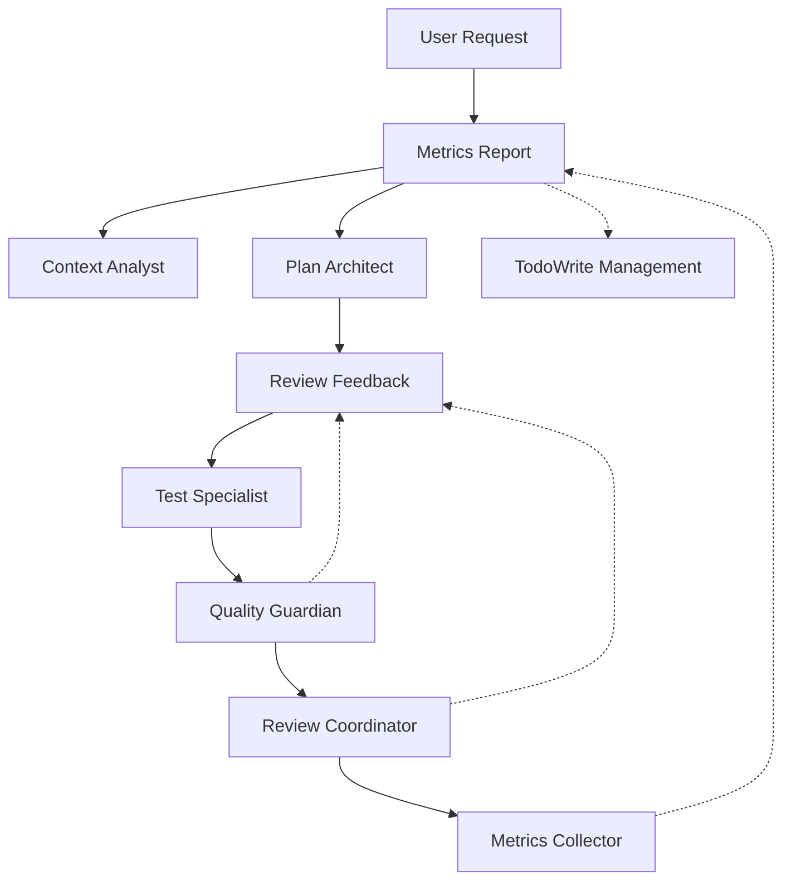

# AI Development Framework: Agent-Based Migration Plan

## Executive Summary

This document outlines the strategic migration from the current manual 18-step framework to a Claude Code sub-agent orchestrated approach. The migration leverages Claude Code's sub-agent capabilities to automate and orchestrate development workflows while maintaining the framework's core principles and quality standards.

## Current State Analysis

### Existing Framework Structure
- **18-step manual workflow** across 4 phases
- **Manual TodoWrite management** for task tracking
- **Human-driven quality gates** and validation
- **Configuration via ~/.claude/CLAUDE.md** (symlinked to dotfiles)
- **Rich documentation set**: README, framework docs, quick reference, ADRs

### Key Strengths to Preserve
- Systematic approach with clear phases
- Comprehensive quality standards (functions <50 lines, coverage >80%)
- Semantic commit messages and git workflow integration
- Project-specific adaptations (JS/TS, Python, Rust)
- Metrics collection and retrospective processes

### Pain Points to Address
- **Manual coordination** between steps
- **Context switching** between different types of tasks
- **Repetitive quality checks** across projects
- **Inconsistent execution** of framework steps
- **Limited scalability** for complex multi-component features

## Claude Code Sub-Agent Strategy

### Core Agent Architecture

#### 1. Framework Orchestrator (`framework-orchestrator`)
```yaml
Purpose: Master controller for the 18-step workflow
Tools: All tools (Read, Write, Edit, Bash, TodoWrite, Task)
Responsibilities:
  - Initialize TodoWrite with framework steps
  - Delegate specialized tasks to sub-agents
  - Coordinate between workflow phases
  - Ensure quality gates are met
  - Generate final reports and metrics
```

#### 2. Context Analyst (`context-analyst`)
```yaml
Purpose: Phase 1 specialist - context preparation and planning
Tools: Read, Glob, Grep, WebFetch
Responsibilities:
  - Analyze project structure and tech stack
  - Review existing patterns and conventions
  - Research dependencies and configuration
  - Generate comprehensive project context
  - Identify quality tools and scripts
```

#### 3. Plan Architect (`plan-architect`)
```yaml
Purpose: Phase 1 specialist - detailed planning and architecture
Tools: Read, Write, Edit, TodoWrite, ExitPlanMode
Responsibilities:
  - Create comprehensive implementation plans
  - Define acceptance criteria and success metrics
  - Perform risk assessment and mitigation
  - Design system architecture and component interactions
  - Generate PLAN_*.md documentation
```

#### 4. Implementation Engineer (`implementation-engineer`)
```yaml
Purpose: Phase 2 specialist - code implementation
Tools: Read, Write, Edit, MultiEdit, NotebookEdit, Bash
Responsibilities:
  - Implement features following quality standards
  - Follow semantic commit message patterns
  - Maintain code complexity limits
  - Create branches and manage git workflow
  - Handle incremental development cycles
```

#### 5. Test Specialist (`test-specialist`)
```yaml
Purpose: Phase 2 specialist - test creation and validation
Tools: Read, Write, Edit, Bash, Glob, Grep
Responsibilities:
  - Analyze existing test patterns
  - Create comprehensive test suites
  - Ensure minimum 80% coverage
  - Run performance benchmarks
  - Validate against acceptance criteria
```

#### 6. Quality Guardian (`quality-guardian`)
```yaml
Purpose: Phase 2-3 specialist - quality assurance
Tools: Read, Bash, Grep, Glob
Responsibilities:
  - Run linting and type checking
  - Execute security scans
  - Verify performance benchmarks
  - Ensure no regressions
  - Generate quality reports
```

#### 7. Review Coordinator (`review-coordinator`)
```yaml
Purpose: Phase 3 specialist - PR and review management
Tools: Read, Write, Bash (for git/gh commands)
Responsibilities:
  - Create comprehensive pull requests
  - Generate PR descriptions with metrics
  - Coordinate review feedback integration
  - Manage merge and cleanup processes
  - Update documentation post-merge
```

#### 8. Metrics Collector (`metrics-collector`)
```yaml
Purpose: Phase 4 specialist - data collection and analysis
Tools: Read, Write, Bash
Responsibilities:
  - Collect implementation metrics
  - Generate performance reports
  - Track time estimates vs actuals
  - Document lessons learned
  - Update framework effectiveness data
```

### Agent Interaction Flow



## Migration Strategy

### Phase 1: Foundation Setup

#### 1.1 Create Core Agents
- Set up the 8 specialized sub-agents in Claude Code
- Define system prompts and tool permissions
- Test basic agent interactions and delegation

#### 1.2 Update Framework Configuration
- Enhance ~/.claude/CLAUDE.md with agent delegation instructions
- Add agent-specific trigger conditions
- Update enforcement rules for agent coordination

#### 1.3 Create Agent Templates
- Develop standardized agent creation scripts
- Document agent interaction patterns
- Establish version control for agent configurations

### Phase 2: Agent Integration

#### 2.1 Framework Orchestrator Implementation
- Build master coordination logic
- Implement phase transitions and quality gates
- Create TodoWrite automation for agent workflows

#### 2.2 Specialized Agent Development
- Implement each specialist agent with full capabilities
- Create inter-agent communication protocols
- Establish error handling and fallback mechanisms

#### 2.3 Quality Assurance Integration
- Integrate existing quality tools with agents
- Automate linting, testing, and security scanning
- Create performance benchmark automation

### Phase 3: Workflow Automation

#### 3.1 End-to-End Workflow Testing
- Test complete 18-step workflow with agents
- Validate quality standards maintenance
- Ensure proper git workflow integration

#### 3.2 Project Adaptation Logic
- Implement automatic project type detection
- Create language-specific agent behaviors
- Test with JavaScript/TypeScript, Python, Rust, and Go projects

#### 3.3 Documentation and Training
- Update all framework documentation
- Create agent usage guides
- Develop troubleshooting procedures

### Phase 4: Production Deployment

#### 4.1 Gradual Rollout
- Start with simple features on personal projects
- Gradually increase complexity and scope
- Monitor performance and quality metrics

#### 4.2 Feedback Integration
- Collect user experience feedback
- Refine agent interactions based on usage
- Optimize performance and reliability

#### 4.3 Framework Evolution
- Update based on real-world usage
- Implement additional specialized agents as needed
- Plan future enhancements and capabilities

## Implementation Details

### Agent Configuration Template

```yaml
# Agent: framework-orchestrator
description: "Master coordinator for 18-step AI development workflow"
system_prompt: |
  You are the Framework Orchestrator for the AI Development Framework.
  
  Your responsibilities:
  1. Initialize TodoWrite with the 18-step framework workflow
  2. Analyze user requests and determine required phases
  3. Delegate specialized tasks to appropriate sub-agents:
     - context-analyst: For project analysis and context preparation
     - plan-architect: For planning and architecture design
     - implementation-engineer: For code implementation
     - test-specialist: For test creation and validation
     - quality-guardian: For quality assurance and checks
     - review-coordinator: For PR management and reviews
     - metrics-collector: For metrics and retrospectives
  4. Coordinate between phases and ensure quality gates
  5. Provide final reports and framework compliance verification
  
  Always follow the 18-step workflow from the framework documentation.
  Use TodoWrite to track progress and mark exactly ONE item as in_progress.
  Ensure all quality standards are met before proceeding to next phase.

tools: ["*"]  # All tools available
auto_delegate: true
proactive: true
```

### Updated ~/.claude/CLAUDE.md Configuration

```markdown
# AI Development Framework Configuration v2.1 - Agent-Enhanced

## Agent-Based Workflow Activation

### Primary Agent: framework-orchestrator
- **Trigger**: Any development task requiring >3 steps
- **Purpose**: Master coordinator for 18-step workflow
- **Delegation**: Automatically delegates to specialized agents

### Agent Hierarchy
1. **framework-orchestrator** (master coordinator)
2. **context-analyst** (Phase 1: context and project analysis)
3. **plan-architect** (Phase 1: planning and architecture)
4. **implementation-engineer** (Phase 2: code implementation)
5. **test-specialist** (Phase 2: testing and validation)
6. **quality-guardian** (Phase 2-3: quality assurance)
7. **review-coordinator** (Phase 3: PR and review management)
8. **metrics-collector** (Phase 4: metrics and retrospectives)

### Agent Coordination Rules
- Only framework-orchestrator can initiate TodoWrite workflows
- Each specialist agent reports back to orchestrator
- Quality gates must be approved by quality-guardian
- All phases must be completed in sequence
- Metrics must be collected by metrics-collector
```

### Quality Standards for Agents

#### Agent Performance Metrics
- **Response Time**: <30 seconds per agent invocation
- **Accuracy**: >95% task completion rate
- **Quality**: All framework standards maintained
- **Consistency**: Same results across multiple runs

#### Agent Quality Checks
- Each agent must validate its outputs before delegation
- Cross-agent validation for critical quality gates
- Automatic fallback to human review for complex decisions
- Comprehensive error handling and recovery

### Project-Specific Agent Behaviors

#### JavaScript/TypeScript Projects
```yaml
context-analyst:
  - Look for: package.json, .eslintrc*, tsconfig.json
  - Identify: npm scripts, ESLint, Prettier, Jest/Vitest
  - Report: Node version, package manager, testing framework

quality-guardian:
  - Commands: "npm run lint && npm run typecheck && npm test"
  - Coverage: Jest/Vitest coverage reports
  - Performance: Bundle size analysis
```

#### Python Projects
```yaml
context-analyst:
  - Look for: pyproject.toml, requirements.txt, setup.py
  - Identify: ruff, black, mypy, pytest
  - Report: Python version, virtual environment, dependencies

quality-guardian:
  - Commands: "ruff check . && mypy . && pytest"
  - Coverage: pytest-cov reports
  - Performance: Memory and execution time profiling
```

#### Rust Projects
```yaml
context-analyst:
  - Look for: Cargo.toml, Cargo.lock
  - Identify: workspace structure, dependencies
  - Report: Rust version, edition, features

quality-guardian:
  - Commands: "cargo clippy && cargo test"
  - Coverage: cargo-tarpaulin reports
  - Performance: cargo bench results
```

#### Go Projects
```yaml
context-analyst:
  - Look for: go.mod, go.sum, Makefile
  - Identify: Go version, modules, build tools
  - Report: Go version, module path, dependencies

quality-guardian:
  - Commands: "go vet && go test ./..."
  - Coverage: "go test -cover ./..."
  - Performance: go benchmark tests
```

## Benefits and Expected Outcomes

### Immediate Benefits
- **Reduced Manual Coordination**: Agents handle workflow orchestration
- **Consistent Execution**: Standardized approach across all projects
- **Faster Iteration**: Parallel agent processing where possible
- **Better Quality**: Specialized agents with focused expertise

### Long-term Benefits
- **Scalability**: Handle complex multi-component features
- **Learning**: Agents improve based on project patterns
- **Customization**: Project-specific optimizations
- **Metrics**: Comprehensive data collection for continuous improvement

### Expected Performance Improvements
- **Planning Time**: 15-30 min → 5-15 min (automated context analysis)
- **Implementation**: 2 hours → 1-1.5 hours (focused specialist work)
- **Quality Checks**: 15-20 min → 5 min (automated execution)
- **Review Cycles**: 3 iterations → 1-2 iterations (higher initial quality)

## Risk Mitigation

### Technical Risks
- **Agent Coordination Failures**: Comprehensive error handling and fallbacks
- **Quality Regression**: Mandatory quality gates and human oversight
- **Context Loss**: Proper inter-agent communication protocols
- **Performance Issues**: Monitoring and optimization procedures

### Process Risks
- **Over-Automation**: Maintain human decision points for architecture
- **Framework Drift**: Regular framework compliance audits
- **Skill Atrophy**: Balance automation with learning opportunities
- **Vendor Lock-in**: Maintain framework portability

### Mitigation Strategies
- Gradual rollout with fallback to manual process
- Comprehensive testing on diverse project types
- Regular human review of agent decisions
- Continuous monitoring of quality metrics

## Success Metrics

### Framework Effectiveness
- Time reduction: >30% improvement in development cycle
- Quality maintenance: No regression in bug rates or test coverage
- Consistency: >95% adherence to framework standards
- Developer satisfaction: Positive feedback on workflow efficiency

### Agent Performance
- Task completion rate: >95% success rate
- Response time: <30 seconds average per agent
- Quality scores: Maintain all existing quality benchmarks
- Error rate: <5% agent coordination failures

## Future Enhancements

### Planned Agent Extensions
- **Security Specialist**: Advanced security scanning and remediation
- **Performance Engineer**: Automated performance optimization
- **Documentation Writer**: Comprehensive documentation generation
- **Deployment Manager**: CI/CD pipeline management and deployment

### Framework Evolution
- Machine learning integration for pattern recognition
- Custom agent creation for organization-specific needs
- Integration with external development tools and services
- Real-time collaboration features for team development

---

*Migration Plan Version: 1.0*  
*Created: 2025-09-04*  
*Target Completion: TBD*  
*Framework Version: 2.1 → 3.0 (Agent-Enhanced)*