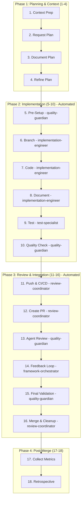

# AI Development Framework v3.0 - Agent-Enhanced Quick Reference

## 🚀 Agent-Automated Workflow At A Glance (18 Steps)



## 📋 Essential Commands

```bash
# Agent-Enhanced Workflow - Just describe your task!
# The framework-orchestrator will handle everything:

# Phase 1: Automated by context-analyst + plan-architect
echo "Auto-generated PROJECT_CONTEXT.md and PLAN_*.md"

# Phase 2: Automated by implementation-engineer + test-specialist + quality-guardian
echo "Auto: branch creation, implementation, testing, quality checks"

# Phase 3: Automated by review-coordinator + quality-guardian
echo "Auto: PR creation, review coordination, validation, merge"

# Phase 4: Automated by metrics-collector
echo "Auto: metrics collection and framework improvement"
```

## 🎯 Agent-Enhanced Framework Rules

### Planning Phase (Steps 1-4) - Automated by context-analyst + plan-architect
- **Auto-generates** PROJECT_CONTEXT.md from project analysis
- **Auto-creates** PLAN_*.md with comprehensive risk assessment
- AI-calculated time estimates and success metrics
- Automated test scenario definition (80% coverage target)

### Implementation Phase (Steps 5-10) - Automated by implementation-engineer + test-specialist + quality-guardian
- Auto-configures pre-commit hooks and quality tools
- Automated branch creation per feature/fix
- AI-enforced functions < 50 lines, complexity < 10
- Continuous documentation during development
- Automated test creation and validation
- Continuous quality checks throughout development

### Review Phase (Steps 11-16) - Automated by review-coordinator + quality-guardian
- Automated CI/CD validation and reporting
- Multi-agent review coordination (8 specialized agents)
- AI-optimized review iterations (< 2 target)
- Automated final validation before merge
- Automated branch cleanup after merge

### Post-Merge Phase (Steps 17-18) - Automated by metrics-collector
- Automated metrics collection and analysis
- AI-driven framework improvements and pattern learning

## 📁 Enhanced File Structure

```
project/
├── .claude/
│   └── CLAUDE.md              # Agent-enhanced configuration v3.0
├── .pre-commit-config.yaml    # Quality gates
├── .gitignore                 # Include PLAN_*.md
├── PROJECT_CONTEXT.md         # Tech stack & patterns
├── PLAN_*.md                  # Planning docs (gitignored)
├── docs/
│   ├── ADRs/                  # Architecture decisions
│   └── CHANGELOG.md           # Release notes
└── src/                       # Your code
```

## 🔄 The Complete Flow

| Phase | Steps | Agent Automation | Expected Time |
|-------|-------|------------------|---------------|
| **Planning** | 1-4 | context-analyst + plan-architect | 5-15 min |
| **Implementation** | 5-10 | implementation-engineer + test-specialist + quality-guardian | 1-1.5 hours |
| **Review** | 11-16 | review-coordinator + quality-guardian | 30-45 min |
| **Post-Merge** | 17-18 | metrics-collector | 5 min |

### Detailed Steps

1. **Context Prep**: (context-analyst) Auto-analyze and update PROJECT_CONTEXT.md
2. **Plan**: (plan-architect) Auto-generate comprehensive PLAN_*.md
3. **Document**: (plan-architect) Auto-save plan with ADRs and metrics
4. **Refine**: (framework-orchestrator) Coordinate plan refinements
5. **Pre-Setup**: (quality-guardian) Auto-configure hooks and templates
6. **Branch**: (implementation-engineer) Auto-create feature branch
7. **Code**: (implementation-engineer) Implement with automated semantic commits
8. **Document**: (implementation-engineer) Auto-generate docs during development
9. **Test**: (test-specialist) Auto-create comprehensive test suite
10. **Quality**: (quality-guardian) Continuous lint, typecheck, security scan
11. **Push**: (review-coordinator) Automated CI/CD pipeline validation
12. **PR**: (review-coordinator) Auto-generate detailed pull request
13. **Agent Review**: (quality-guardian) Multi-agent code review
14. **Feedback**: (framework-orchestrator) Coordinate review feedback
15. **Validate**: (quality-guardian) Automated final quality checks
16. **Merge**: (review-coordinator) Automated clean merge and cleanup
17. **Metrics**: (metrics-collector) Auto-collect performance data
18. **Retro**: (metrics-collector) AI-driven framework improvements

## ⚡ Performance Targets

| Metric | Target | Step |
|--------|--------|------|
| Planning Time | 15-30 min | 1-4 |
| Implementation | < 2 hours | 5-10 |
| Review Cycles | < 3 | 11-16 |
| Test Coverage | >= 80% | 9 |
| API Response | < 200ms | 10 |
| Build Time | < 5 min | 11 |
| Bug Rate | < 1/100 LOC | 17 |

## 🛠 Enhanced Tool Integration

**Nvim + LazyVim**:
```lua
{
  "github/copilot.vim",
  "antropic/claude.nvim", 
  "folke/trouble.nvim",    -- Diagnostics
  "lewis6991/gitsigns.nvim" -- Git integration
}
```

**Git Aliases**:
```bash
git config --global alias.plan "checkout -b"
git config --global alias.publish "push -u origin HEAD" 
git config --global alias.semantic "commit -m"
```

**Pre-commit Hooks**:
```yaml
repos:
  - repo: local
    hooks:
      - id: lint
      - id: typecheck
      - id: test
      - id: security-scan
```

## 🚨 Never Do This

- ❌ Code without updating PROJECT_CONTEXT.md
- ❌ Skip plan creation or refinement
- ❌ Commit to main directly
- ❌ Ignore pre-commit hooks
- ❌ Skip quality checks
- ❌ Ignore AI review feedback
- ❌ Merge without final validation
- ❌ Skip metrics collection

## 📊 Success Dashboard

### Quality Gates ✅
- [ ] PROJECT_CONTEXT.md updated
- [ ] PLAN_*.md created and refined
- [ ] Pre-commit hooks configured
- [ ] Feature branch created
- [ ] Code follows quality standards
- [ ] Tests written (80% coverage)
- [ ] CI/CD pipeline passes
- [ ] Multi-AI review completed
- [ ] All feedback addressed
- [ ] Final validation passed
- [ ] Metrics collected
- [ ] Retrospective completed

### Agent Usage 🤖
- **framework-orchestrator**: Master workflow coordination
- **context-analyst**: Project structure and tech stack analysis
- **plan-architect**: Comprehensive planning and architecture
- **implementation-engineer**: Code implementation and documentation
- **test-specialist**: Test creation and validation
- **quality-guardian**: Quality assurance and performance monitoring
- **review-coordinator**: PR management and review coordination
- **metrics-collector**: Data collection and framework improvement

## 💡 Pro Tips

1. **Context is King** - Always update PROJECT_CONTEXT.md
2. **Plan Thoroughly** - 30 minutes planning saves 2 hours coding
3. **Quality First** - Don't skip any quality gates
4. **Test Everything** - 80% coverage minimum
5. **Document Always** - ADRs and inline docs
6. **Review Rigorously** - Multi-AI catches more issues
7. **Measure Progress** - Metrics drive improvement
8. **Iterate Framework** - Continuous improvement

## 🎖 Excellence Checklist

**Before Starting:**
- [ ] Updated PROJECT_CONTEXT.md
- [ ] Created detailed PLAN_*.md
- [ ] Configured quality gates
- [ ] Set success metrics

**Before Committing:**
- [ ] Lint, typecheck, test passed
- [ ] Coverage >= 80%
- [ ] Security scan clean
- [ ] Documentation updated

**Before Merging:**
- [ ] CI/CD pipeline green
- [ ] AI reviews addressed
- [ ] Performance benchmarks met
- [ ] No breaking changes

**After Merging:**
- [ ] Metrics collected
- [ ] Framework improvements identified
- [ ] Team learnings shared

---

*Remember: This is about systematic excellence, not just following steps. Each phase builds quality into the next.*

**Framework Version:** 3.0.0 (Agent-Enhanced)  
**Last Updated:** 2025-09-04