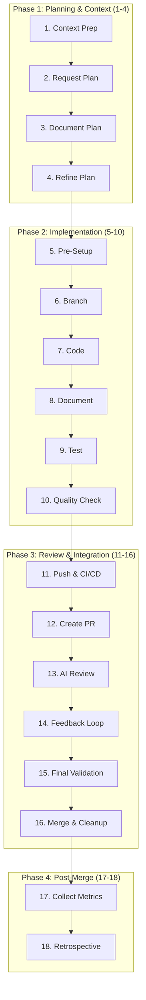

# AI Development Framework v2.0 - Quick Reference

## 🚀 Enhanced Workflow At A Glance (18 Steps)



## 📋 Essential Commands

```bash
# Phase 1: Planning (Steps 1-4)
echo "Create PROJECT_CONTEXT.md and PLAN_*.md"

# Phase 2: Implementation (Steps 5-10)
git checkout -b feature/name                    # Step 6
npm run lint && npm run typecheck && npm test   # Step 10
git add -A && git commit -m "feat: description" # Step 7

# Phase 3: Review (Steps 11-16)
git push -u origin HEAD                         # Step 11
gh pr create                                    # Step 12

# Phase 4: Post-merge (Steps 17-18)
echo "Collect metrics and retrospective"
```

## 🎯 Enhanced Framework Rules

### Planning Phase (Steps 1-4)
- **Always** create/update `PROJECT_CONTEXT.md`
- **Always** create `PLAN_*.md` with risk assessment
- Include time estimates and success metrics
- Define test scenarios upfront (80% coverage target)

### Implementation Phase (Steps 5-10)
- Configure pre-commit hooks first
- Branch per feature/fix (never commit to main)
- Functions < 50 lines, complexity < 10
- Document during development
- Test after implementation
- Quality checks before push

### Review Phase (Steps 11-16)
- CI/CD must pass (tests, coverage, security)
- Multi-AI review (Copilot + Claude)
- < 3 review iterations target
- Final validation before merge
- Clean up branches after merge

### Post-Merge Phase (Steps 17-18)
- Collect implementation metrics
- Update framework based on learnings

## 📁 Enhanced File Structure

```
project/
├── .claude/
│   └── CLAUDE.md              # AI configuration v2.0
├── .pre-commit-config.yaml    # Quality gates
├── .gitignore                 # Include PLAN_*.md
├── PROJECT_CONTEXT.md         # Tech stack & patterns
├── PLAN_*.md                  # Planning docs (gitignored)
├── docs/
│   ├── ADRs/                  # Architecture decisions
│   └── CHANGELOG.md           # Release notes
└── src/                       # Your code
```

## 🔄 The Complete Flow

| Phase | Steps | Focus | Time |
|-------|-------|-------|------|
| **Planning** | 1-4 | Context, plan, refine | 15-30 min |
| **Implementation** | 5-10 | Setup, code, test, quality | < 2 hours |
| **Review** | 11-16 | CI/CD, PR, review, merge | < 1 hour |
| **Post-Merge** | 17-18 | Metrics, improve | 10 min |

### Detailed Steps

1. **Context Prep**: Update PROJECT_CONTEXT.md
2. **Plan**: Create comprehensive PLAN_*.md
3. **Document**: Save plan with ADRs and metrics
4. **Refine**: Iterate on plan details
5. **Pre-Setup**: Configure hooks and templates
6. **Branch**: Create feature branch
7. **Code**: Implement with semantic commits
8. **Document**: Write docs during development
9. **Test**: Comprehensive test suite
10. **Quality**: Lint, typecheck, security scan
11. **Push**: CI/CD pipeline validation
12. **PR**: Detailed pull request
13. **AI Review**: Multi-AI code review
14. **Feedback**: Address review comments
15. **Validate**: Final quality checks
16. **Merge**: Clean merge and cleanup
17. **Metrics**: Collect performance data
18. **Retro**: Improve framework

## ⚡ Performance Targets

| Metric | Target | Step |
|--------|--------|------|
| Planning Time | 15-30 min | 1-4 |
| Implementation | < 2 hours | 5-10 |
| Review Cycles | < 3 | 11-16 |
| Test Coverage | >= 80% | 9 |
| API Response | < 200ms | 10 |
| Build Time | < 5 min | 11 |
| Bug Rate | < 1/100 LOC | 17 |

## 🛠 Enhanced Tool Integration

**Nvim + LazyVim**:
```lua
{
  "github/copilot.vim",
  "antropic/claude.nvim", 
  "folke/trouble.nvim",    -- Diagnostics
  "lewis6991/gitsigns.nvim" -- Git integration
}
```

**Git Aliases**:
```bash
git config --global alias.plan "checkout -b"
git config --global alias.publish "push -u origin HEAD" 
git config --global alias.semantic "commit -m"
```

**Pre-commit Hooks**:
```yaml
repos:
  - repo: local
    hooks:
      - id: lint
      - id: typecheck
      - id: test
      - id: security-scan
```

## 🚨 Never Do This

- ❌ Code without updating PROJECT_CONTEXT.md
- ❌ Skip plan creation or refinement
- ❌ Commit to main directly
- ❌ Ignore pre-commit hooks
- ❌ Skip quality checks
- ❌ Ignore AI review feedback
- ❌ Merge without final validation
- ❌ Skip metrics collection

## 📊 Success Dashboard

### Quality Gates ✅
- [ ] PROJECT_CONTEXT.md updated
- [ ] PLAN_*.md created and refined
- [ ] Pre-commit hooks configured
- [ ] Feature branch created
- [ ] Code follows quality standards
- [ ] Tests written (80% coverage)
- [ ] CI/CD pipeline passes
- [ ] Multi-AI review completed
- [ ] All feedback addressed
- [ ] Final validation passed
- [ ] Metrics collected
- [ ] Retrospective completed

### AI Model Usage 🤖
- **Claude**: Planning, complex logic, architecture
- **Copilot**: Reviews, completions, refactoring
- **Specialized**: Security, performance analysis

## 💡 Pro Tips

1. **Context is King** - Always update PROJECT_CONTEXT.md
2. **Plan Thoroughly** - 30 minutes planning saves 2 hours coding
3. **Quality First** - Don't skip any quality gates
4. **Test Everything** - 80% coverage minimum
5. **Document Always** - ADRs and inline docs
6. **Review Rigorously** - Multi-AI catches more issues
7. **Measure Progress** - Metrics drive improvement
8. **Iterate Framework** - Continuous improvement

## 🎖 Excellence Checklist

**Before Starting:**
- [ ] Updated PROJECT_CONTEXT.md
- [ ] Created detailed PLAN_*.md
- [ ] Configured quality gates
- [ ] Set success metrics

**Before Committing:**
- [ ] Lint, typecheck, test passed
- [ ] Coverage >= 80%
- [ ] Security scan clean
- [ ] Documentation updated

**Before Merging:**
- [ ] CI/CD pipeline green
- [ ] AI reviews addressed
- [ ] Performance benchmarks met
- [ ] No breaking changes

**After Merging:**
- [ ] Metrics collected
- [ ] Framework improvements identified
- [ ] Team learnings shared

---

*Remember: This is about systematic excellence, not just following steps. Each phase builds quality into the next.*

**Framework Version:** 2.0.0  
**Last Updated:** 2025-09-02