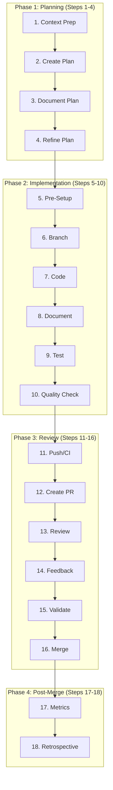

# AI Development Framework v3.1 - Agent-Enhanced

> A systematic Claude Code sub-agent orchestrated approach to AI-assisted software development featuring automated hooks, specialized skills, MCP integration, and proactive agent triggers.

## Quick Start

1. **Install Framework Configuration**
   ```bash
   # Clone and setup via dotfiles
   cd ~/dotfiles/claude/.claude

   # Structure after setup:
   # ~/.claude/
   # ├── CLAUDE.md → dotfiles symlink
   # ├── commands/ → dotfiles symlink
   # ├── hooks/    → dotfiles symlink
   # ├── skills/   → dotfiles symlink
   # └── mcp.json  → dotfiles symlink

   stow -d ~/dotfiles -t ~ claude
   ```

2. **Use Slash Commands**
   ```bash
   /agent "Add user authentication to the API"    # Full orchestrated workflow
   /context                                       # Analyze project context
   /quality                                       # Run all quality checks
   /security-scan                                 # Security audit
   /pr-summary                                    # Generate PR summary
   ```

3. **Leverage Skills**
   ```bash
   # Skills are automatically invoked based on context
   # Or manually via agent delegation
   ```

---

## What's New in v3.1

| Feature | Description |
|---------|-------------|
| **Hooks System** | Pre-edit file protection, pre-commit quality gates |
| **Skills** | Specialized read-only analysis (security, context, performance) |
| **Slash Commands** | `/security-scan`, `/pr-summary`, `/context`, `/quality` |
| **MCP Integration** | GitHub, filesystem, memory servers |
| **Proactive Triggers** | Agents auto-delegate based on task patterns |
| **Model Optimization** | Opus for orchestration, Sonnet for execution |

---

## Framework Architecture

### Agent Hierarchy with Model Assignments

| Agent | Model | Proactive Trigger |
|-------|-------|-------------------|
| **framework-orchestrator** | opus | MUST BE USED for tasks >3 steps |
| **plan-architect** | opus | MUST BE USED for architectural decisions |
| **context-analyst** | sonnet | Use PROACTIVELY before implementation |
| **implementation-engineer** | sonnet | Execute approved plans |
| **test-specialist** | sonnet | Use PROACTIVELY after implementation |
| **quality-guardian** | sonnet | MUST BE USED before commit/PR/merge |
| **review-coordinator** | sonnet | PR and review workflows |
| **metrics-collector** | sonnet | Post-completion metrics |
| **forensic-specialist** | sonnet | Security audits and threat analysis |

### Inter-Agent Communication Protocol

```
1. Handoff Format:    JSON {task_id, status, findings, next_steps}
2. Quality Signals:   PASS/FAIL/WARN with violations
3. Escalation Path:   Any Agent → quality-guardian → framework-orchestrator
4. Metrics Reporting: All agents → metrics-collector
```

### 18-Step Workflow



---

## Usage Manual

### Hooks System

Hooks automate quality enforcement without manual intervention.

#### Pre-Edit Hook (File Protection)

Automatically blocks edits to sensitive files:
- `.env*` - Environment files
- `*.key`, `*.pem` - Cryptographic keys
- `credentials*` - Credential files
- `.git/*` - Git internals

```json
// ~/.claude/hooks/pre-edit.json
{
  "hooks": {
    "PreToolUse": [{
      "matcher": {
        "tool": ["Edit", "Write"],
        "file_pattern": [".env*", "*.key", "credentials*"]
      },
      "action": "block",
      "message": "Protected file - requires explicit approval"
    }]
  }
}
```

#### Pre-Commit Hook (Quality Gate)

Runs automatically before any `git commit`:
- Auto-format code
- Run linters
- Execute type checking
- Run test suite

```json
// ~/.claude/hooks/pre-commit.json
{
  "hooks": {
    "PreToolUse": [{
      "matcher": {
        "tool": "Bash",
        "command_pattern": "git commit*"
      },
      "action": "run",
      "commands": [
        {"format": "npm run format --if-present"},
        {"lint": "npm run lint --if-present"},
        {"typecheck": "npm run typecheck --if-present"},
        {"test": "npm test --if-present || true"}
      ]
    }]
  }
}
```

---

### Skills

Skills are specialized, tool-restricted analysis modes.

#### Security Review Skill
```bash
# Automatically invoked for security-related tasks
# Tools: Read, Grep, Glob, WebSearch (read-only)

# Performs:
# - Hardcoded secrets scan
# - SQL injection detection
# - XSS risk assessment
# - Auth/authz review
# - Dependency vulnerability check
```

#### Context Analysis Skill
```bash
# Use PROACTIVELY when entering new codebases
# Tools: Read, Grep, Glob (read-only)

# Generates:
# - Tech stack detection
# - Architecture patterns
# - Test framework discovery
# - Quality tool detection
```

#### Performance Audit Skill
```bash
# For performance optimization tasks
# Tools: Read, Grep, Glob, Bash

# Analyzes:
# - N+1 query patterns
# - Blocking operations
# - Memory leak patterns
# - Caching opportunities
```

---

### Slash Commands

Quick access to common workflows.

| Command | Description | Example |
|---------|-------------|---------|
| `/agent <task>` | Full orchestrated workflow | `/agent "Add dark mode"` |
| `/context` | Refresh project analysis | `/context` |
| `/quality` | Run all quality checks | `/quality` |
| `/security-scan` | Security audit | `/security-scan` |
| `/pr-summary` | Generate PR summary | `/pr-summary` |

#### /context Command
```markdown
Analyzes:
1. Project structure and entry points
2. Tech stack and versions
3. Quality tools available
4. Coding patterns in use
5. Recent architectural changes
```

#### /quality Command
```markdown
Runs:
1. Linting (ESLint/ruff/clippy/go vet)
2. Type checking (TypeScript/mypy/cargo check)
3. Formatting check (Prettier/black/rustfmt/gofmt)
4. Test suite
5. Complexity metrics
```

#### /security-scan Command
```markdown
Checks:
1. Staged changes for secrets
2. New dependencies for vulnerabilities
3. Security anti-patterns
4. Report with severity levels
```

#### /pr-summary Command
```markdown
Generates:
1. Change summary by category
2. Modified files list
3. Breaking changes identification
4. Test plan recommendations
```

---

### MCP Integration

Model Context Protocol servers extend Claude's capabilities.

```json
// ~/.claude/mcp.json
{
  "mcpServers": {
    "github": {
      "transport": "http",
      "url": "https://api.githubcopilot.com/mcp/v1",
      "description": "GitHub PR/Issue automation"
    },
    "filesystem": {
      "transport": "stdio",
      "command": "npx",
      "args": ["-y", "@modelcontextprotocol/server-filesystem"],
      "description": "Enhanced file operations"
    },
    "memory": {
      "transport": "stdio",
      "command": "npx",
      "args": ["-y", "@modelcontextprotocol/server-memory"],
      "description": "Cross-session context"
    }
  }
}
```

---

## Quick Tips

### 1. Let Agents Work Proactively
Agents have proactive triggers - don't micromanage. Say:
```
"Add user authentication"
```
Not:
```
"First analyze the codebase, then create a plan, then implement..."
```

### 2. Use Slash Commands for Speed
```bash
/quality          # Instead of manually running lint, test, typecheck
/context          # Instead of exploring files manually
/security-scan    # Instead of manual security review
```

### 3. Trust the Hooks
Don't manually format or lint - hooks handle it on commit:
```bash
git commit -m "feat: add feature"  # Auto-formats and validates
```

### 4. Skills are Read-Only
Skills can't modify code - they're for analysis. Use them freely:
- Security reviews before PRs
- Context analysis for unfamiliar code
- Performance audits before optimization

### 5. Model Selection Matters
- **Opus** (orchestrator, architect): Complex reasoning, architecture
- **Sonnet** (specialists): Fast execution, implementation tasks

### 6. TodoWrite is Your Friend
Every task >2 steps should use TodoWrite:
```
1. Mark in_progress BEFORE starting
2. Mark completed IMMEDIATELY after finishing
3. Only ONE task in_progress at a time
```

### 7. Quality Standards (Memorize These)
```
Functions: < 50 lines
Files:     < 500 lines
Complexity: < 10
Coverage:  >= 80%
```

### 8. Semantic Commits
```bash
feat:     # New feature
fix:      # Bug fix
refactor: # Code restructuring
test:     # Adding tests
docs:     # Documentation
```

### 9. Branch Naming
```bash
feature/descriptive-name
fix/issue-description
refactor/component-name
```

### 10. When Stuck, Use Context
```bash
/context  # Refresh understanding
# Then describe what you need
```

---

## Directory Structure

```
~/.claude/
├── CLAUDE.md              # Main configuration (18-step workflow)
├── settings.json          # Permissions and preferences
├── mcp.json              # MCP server configuration
├── commands/
│   ├── agent.md          # /agent command
│   ├── context.md        # /context command
│   ├── quality.md        # /quality command
│   ├── security-scan.md  # /security-scan command
│   └── pr-summary.md     # /pr-summary command
├── hooks/
│   ├── pre-edit.json     # File protection
│   └── pre-commit.json   # Quality gates
├── skills/
│   ├── security-review.md
│   ├── context-analysis.md
│   └── performance-audit.md
└── agents/               # Agent definitions
    ├── framework-orchestrator.md
    ├── context-analyst.md
    ├── plan-architect.md
    ├── implementation-engineer.md
    ├── test-specialist.md
    ├── quality-guardian.md
    ├── review-coordinator.md
    ├── metrics-collector.md
    └── forensic-specialist.md
```

---

## Configuration Examples

### JavaScript/TypeScript
```bash
# Quality check (automated by hooks)
npm run lint && npm run typecheck && npm test
```

### Python
```bash
# Quality check (automated by hooks)
ruff check . && mypy . && pytest --cov=.
```

### Rust
```bash
# Quality check (automated by hooks)
cargo clippy && cargo fmt --check && cargo test
```

### Go
```bash
# Quality check (automated by hooks)
go vet ./... && go test -cover ./...
```

---

## Performance Targets

| Metric | Target |
|--------|--------|
| Planning Time | 15-30 min |
| Implementation | < 2 hours |
| Review Cycles | < 3 |
| Test Coverage | >= 80% |
| API Response | < 200ms |
| Bug Rate | < 1/100 LOC |

---

## Files Reference

| File | Purpose |
|------|---------|
| [AI_DEVELOPMENT_FRAMEWORK.md](AI_DEVELOPMENT_FRAMEWORK.md) | Complete 18-step documentation |
| [QUICK_REFERENCE.md](QUICK_REFERENCE.md) | Daily cheat sheet |
| [AGENTS_PLAN.md](AGENTS_PLAN.md) | Agent architecture |
| [agents/](agents/) | Agent definitions |
| [CLAUDE_CONFIGURATION_SAMPLE.md](CLAUDE_CONFIGURATION_SAMPLE.md) | Sample configuration |
| [CHANGELOG.md](CHANGELOG.md) | Version history |

---

## Version History

- **v3.1.0** (2025-11-26): Hooks, skills, expanded commands, MCP integration, proactive triggers
- **v3.0.0** (2025-09-04): Agent-enhanced with Claude Code sub-agents
- **v2.0.0** (2025-09-02): Enhanced 18-step workflow
- **v1.0.0** (2025-09-02): Initial 11-step framework

See [CHANGELOG.md](CHANGELOG.md) for details.

---

## Support

- **Issues**: GitHub Issues
- **Documentation**: This repository
- **Email**: joaoariedi@gmail.com

## License

MIT License - see [LICENSE](LICENSE)

---

**Framework Version**: 3.1.0 (Agent-Enhanced with Hooks & Skills)
**Last Updated**: 2025-11-26
**Compatibility**: Claude Code with sub-agents, hooks, skills, MCP

*Systematic excellence through automation. The framework works for you, not the other way around.*
