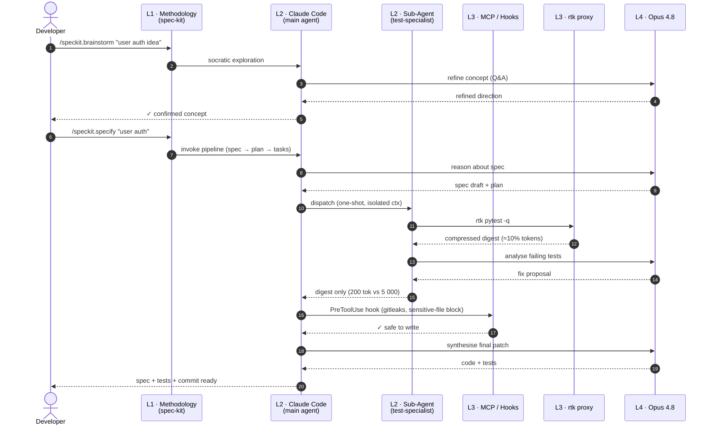

# 🤖 AI Development Framework v4.5

> A systematic Claude Code configuration for **spec-driven development (SDD)** with quality gates, custom agents, automated hooks, security guardrails, and a full specification pipeline. Balances **security**, **performance**, **maintainability**, and **efficacy** at every step.

---

## ⚡ Quick Start

> **Just want it installed?** Hand `SETUP.md` to a Claude Code agent — it is a runbook written for an agent to execute, and it does everything below (clone, install, permission rule, verification) and reports what it did. The rest of this section is the same thing for humans, and explains *why* each step exists.

### 1️⃣ Install as a Plugin (recommended)

The framework is a Claude Code plugin. **The hooks ship with it** — you no longer hand-write `settings.json`, which is where every previous version leaked its most-reported friction.

A plugin is installed **from a marketplace**, so the framework ships one (`.claude-plugin/marketplace.json`) that lists exactly one plugin: itself. Clone once, then point the marketplace at the clone:

```bash
git clone https://github.com/joaoariedi/ai-assisted-development-framework.git ~/.claude-framework

claude plugin marketplace add ~/.claude-framework
claude plugin install ai-development-framework@ai-development-framework
```

That is a **persistent, user-scoped** install: it writes `enabledPlugins` to `~/.claude/settings.json` and applies to every project, in every session, with no flags. Confirm it:

```bash
claude plugin list          # → ai-development-framework@ai-development-framework  ✔ enabled
```

Because the marketplace source is a **directory**, the plugin is read from your clone in place — nothing is copied. **Updating is therefore just `git pull`** (see *Updating* below), and the install path is stable and predictable, which the permission rule in step 2 depends on.

<details>
<summary><b>Alternative: try it for a single session, without installing</b></summary>

```bash
claude --plugin-dir ~/.claude-framework      # this session only; nothing is written to settings
claude plugin validate ~/.claude-framework   # check the manifest without loading it
```

</details>

The plugin bundles **skills, commands, agents, hooks, workflows, and the MCP server** in one unit.

> **⚠️ Do not stow the dotfiles *and* install the plugin.** Every component would register twice. If `~/.claude/agents/` or `~/.claude/commands/` already contains these files from the legacy stow install, remove them (`stow -D claude`) before installing the plugin.

#### What the plugin is called once installed

Plugin components are **namespaced by plugin name**, but the namespace is only *required* where a bare name is ambiguous or unsupported:

| Component | How you invoke it |
|---|---|
| **Commands** | `/project-context`, `/speckit.plan`, `/quality` — the bare name works. The `ai-development-framework:` prefix also works, and disambiguates if another plugin defines the same name. |
| **Agents** | Dispatched by Claude, or by name — they appear as `ai-development-framework:code-reviewer`. |
| **The workflow** | **Must be namespaced**: `ai-development-framework:speckit-workflow`. A bare `speckit-workflow` **does not resolve**. |

### 2️⃣ Optional Configuration

Two things the plugin cannot ship, because they are machine-local by design:

```jsonc
// In ~/.claude/settings.json — only if you want these:
{
  "env": { "CLAUDE_CODE_EXPERIMENTAL_AGENT_TEAMS": "1" },   // Agent Teams (experimental)
  "permissions": {
    "allow": [
      "Bash($HOME/.claude-framework//hooks/speckit-helper.sh:*)",
      "Bash($HOME/.claude-framework/hooks/speckit-helper.sh:*)"
    ]
  }
}
```

> ⚠️ The `speckit-helper.sh` permission avoids a prompt on every spec-kit command. The commands run the helper with the Bash tool; they cannot pre-execute it in a `` !`…` `` block, because a `!` block is permission-checked *before* `${CLAUDE_PLUGIN_ROOT}` is substituted and is rejected outright as `Contains expansion`.
>
> **The doubled slash in the first entry is not a typo.** `${CLAUDE_PLUGIN_ROOT}` expands *with* a trailing slash, so the helper reaches the permission matcher as `…/.claude-framework//hooks/…`. The matcher compares literally and does not normalise `//`, so a single-slash rule never matches it. The second entry covers a future release dropping the trailing slash. Keep both.
>
> **The path must be absolute and must point at your clone.** Permission rules expand `$HOME` but **not** `${CLAUDE_PLUGIN_ROOT}`, and they do not accept a leading wildcard, so neither shortcut works. The rule above assumes the `~/.claude-framework` clone path from step 1; if you cloned elsewhere, substitute that directory.
>
> **This is the single most common failure.** A pre-flight command that is denied aborts the whole slash command **silently** — no error, no output, exit 0. If a spec-kit command appears to do nothing at all, this rule is the first thing to check.

Export `GITHUB_TOKEN` if you want the bundled GitHub MCP server to connect.

### 3️⃣ Verify the Installation

```bash
cd ~/any-project && claude
```

Three checks, in increasing strength:

1. **`claude plugin list`** — the plugin is `✔ enabled`. If it is not here, nothing else matters.
2. **The `/` menu** — every command should be listed. **A component that does not appear is not loaded**, and its absence is silent. This is the only reliable test.
3. **Run one** — `/project-context` should print a tech-stack summary. If it prints *nothing*, the pre-flight permission rule in step 2 is missing (see the warning above).

> ⚠️ `claude plugin details ai-development-framework` prints a component inventory, but it reports **`Agents (0)`** for this plugin even though all six agents load correctly. That is a quirk of the inventory display, not a fault in your install — confirmed by dispatching the agents in a live session. Do not chase it.

### 4️⃣ Your First Feature (the 60-second tour)

The framework's core loop is **spec first, then code, then a gate you cannot talk your way past.**

```bash
/speckit.init                    # once per project — bootstraps .specify/
/speckit.specify  add user login # → a spec: scenarios, requirements, success criteria
/speckit.plan                    # → an implementation plan (writes are blocked outside .specify/)
/speckit.tasks                   # → a phased, dependency-ordered task list
/speckit.implement               # → TDD execution, red-green, one task at a time
/quality                         # → lint, types, secrets, SOLID — before you commit
```

For a **large** task list, swap the last implementation step for the workflow, which runs independent tasks in parallel and has every task adversarially verified by agents that did not write it:

```
ai-development-framework:speckit-workflow
```

Not every change deserves a spec. For a typo or a config tweak, `/speckit.fix` skips the pipeline. For an existing codebase with no specs, `/speckit.baseline` reverse-engineers them.

**What happens without you asking:** on every edit, formatters run and tests fire; on every `git commit`, secrets detection and linting must pass or the commit is blocked; and a task cannot be marked complete while the test suite fails. You do not opt into these — they ship with the plugin.

### 5️⃣ Updating

The plugin is read from your clone in place, so updating is a `git pull`:

```bash
git -C ~/.claude-framework pull
claude plugin marketplace update ai-development-framework   # re-read the manifest
```

Restart Claude Code to pick up the new components. To check what changed first, read `CHANGELOG.md` in the clone.

<details>
<summary><b>Legacy: install via dotfiles + stow</b></summary>

The original mechanism still works, but it cannot ship hooks — you must hand-write `settings.json`, and every new hook needs a manual edit.

```bash
git clone git@github.com:joaoariedi/dotfiles.git ~/dotfiles
cd ~/dotfiles && stow claude    # symlinks CLAUDE.md, rules/, agents/, commands/, skills/, hooks/ into ~/.claude/
```

> ⚠️ **Do not use both.** Stowing the config *and* installing the plugin registers every skill, command, and agent **twice**. Pick one. Stow remains useful for `CLAUDE.md` and `rules/`, which are not plugin components — so if you want those globally, stow them and install the plugin only in projects that need it.

</details>

---

## 🖥️ Reference Deployment

This is the topology I run the framework on. The framework itself is host-agnostic — this section just documents one tested setup with explicit trust boundaries.

### 🔀 Two-Machine Topology

| Role | OS | Production Access | Always-On | Used For |
|------|-----|-------------------|-----------|----------|
| 💻 **Primary laptop** | Manjaro Linux | ✅ Full | ❌ No | Day-to-day dev, production deploys, attended sessions |
| 🖧 **Always-on remote workstation** | Arch Linux | ❌ GitHub only | ✅ Yes | Long-running tasks, mobile resume target, off-hours work |

Both machines install the **same plugin** from the same clone, so Claude Code behaviour is identical on each: same agents, hooks, skills, workflows, MCP server. Only the per-host `settings.json` (env vars, the helper permission rule, hook timeouts) differs — which is exactly the machine-local part a plugin cannot ship.

### 🛡️ Trust Boundaries

The blast-radius asymmetry is deliberate:

- 🔐 **Production credentials live only on the laptop.** It is offline most of the time and physically attended.
- 🌐 **The always-on workstation can reach GitHub but not production.** A compromise of the higher-exposure host (always online) cannot pivot into production systems.
- 🔗 **Network is Tailscale-only.** Strict ACLs constrain which hosts can reach which services — no public IPs, no port-forwarding, no inbound exposure.
- 👁️ **Wazuh monitors the whole stack** — file-integrity monitoring, auth events, command auditing — across both machines and any production hosts.

### 🌐 Why the Topology Matters for AI Agents

Claude Code's session-portability features pair naturally with this setup:

- ▶️ Start a long-running task on the **always-on workstation** before stepping away
- 🔄 Resume from the **laptop** later via `/teleport` (see [Multi-Environment Workflows](#-multi-environment-workflows))
- 📱 Or — start on **mobile** (claude.ai/code), pull into the laptop terminal when home

Critically, the always-on workstation can **autonomously work on GitHub repos** (review PR feedback, run CI, commit fixes) without ever holding production credentials. The laptop holds the keys; the always-on host holds the time.

---

## 🧬 Development Lifecycle

The framework provides three workflow paths. Choose the one that matches your task:

### ⚡ Quick Fix Path (trivial changes)

For typos, config updates, formatting fixes, and dependency bumps:

```
/speckit.fix "fix typo in error message"   → apply fix → verify → commit
```

The triviality gate ensures only genuinely trivial changes bypass the full pipeline. If your change modifies logic, APIs, or schemas, you'll be redirected to the Standard path.

### 📋 Standard SDD Path (features, refactors, bug fixes)

The full spec-driven development pipeline from idea to implementation:

```
/project-context              → 🧭 orient (detect stack, tools, structure)
/speckit.init         → 🏗️ bootstrap (once per project)
/speckit.constitution → 📜 define principles (once per project)
/speckit.brainstorm   → 💡 Socratic design exploration (refine the idea) ← NEW
/speckit.specify      → ✍️ write spec (scenarios, requirements, criteria)
/speckit.clarify      → 🔍 resolve ambiguities (optional)
/speckit.plan         → 📐 design (affected files, data model, API contracts)
/speckit.review       → 🔎 challenge the plan (scope, architecture, tests) ← NEW
/speckit.tasks        → 📋 generate task list (phased, with dependencies)
/speckit.checklist    → ✅ pre-implementation gate (optional)
/speckit.analyze      → 🔬 consistency check (optional)
/speckit.implement    → 🧪 TDD execution (red-green cycle)
ai-development-framework:speckit-workflow
                      → ⚡ same, as a Workflow: parallel + adversarially verified ← NEW
/quality              → 🛡️ final quality gate
```

Specifications live in `.specify/specs/<branch>/` and are committed to version control. A constitution in `.specify/memory/constitution.md` defines project-level governance principles that every plan is validated against.

### 🏗️ Brownfield Path (existing code)

For projects with existing code that lack formal specifications:

```
/speckit.baseline     → 📊 reverse-engineer spec from code ← NEW
/speckit.review       → 🔎 review the inferred spec/plan
/speckit.tasks        → 📋 generate tasks for enhancements
/speckit.implement    → 🧪 execute with quality gates
```

### ⚖️ The Four Balances

Every decision in the framework balances four concerns:

| Concern | How the Framework Addresses It |
|---------|-------------------------------|
| 🔒 **Security** | Hooks block sensitive files, gitleaks secrets scanning, OWASP LLM rules, forensic-specialist agent |
| ⚡ **Performance** | performance-audit skill, quality-guardian benchmarks, CI optimization (cancel-in-progress, staged-files-only lint) |
| 🏛️ **Maintainability** | SOLID principle checks, code quality limits, systematic-debugging skill, cross-cutting change maps |
| 🎯 **Efficacy** | Iron Laws prevent false completions, spec compliance gates, built-in `/verify` to drive the real app |

---

## 🔁 Request Flow & Stack Composition

The framework composes 5 layers — **methodology** (spec-kit), **agent runtime** (Claude Code), specialised **sub-agents**, **integrations** (MCP, hooks, rtk, security CLIs), and **models** (Opus 4.8 / Sonnet 5 / Haiku 4.5) — with cross-cutting governance for quality, security, context, and memory. A single SDD request traverses every layer:


```mermaid
sequenceDiagram
    autonumber
    actor Dev as Developer
    participant FW as L1 · Methodology<br/>(spec-kit)
    participant CC as L2 · Claude Code<br/>(main agent)
    participant Sub as L2 · Sub-Agent<br/>(test-specialist)
    participant MCP as L3 · MCP / Hooks
    participant RTK as L3 · rtk proxy
    participant Mod as L4 · Opus 4.8

    Dev->>FW: /speckit.brainstorm "user auth idea"
    FW->>CC: socratic exploration
    CC->>Mod: refine concept (Q&A)
    Mod-->>CC: refined direction
    CC-->>Dev: ✓ confirmed concept
    Dev->>FW: /speckit.specify "user auth"
    FW->>CC: invoke pipeline (spec → plan → tasks)
    CC->>Mod: reason about spec
    Mod-->>CC: spec draft + plan
    CC->>Sub: dispatch (one-shot, isolated ctx)
    Sub->>RTK: rtk pytest -q
    RTK-->>Sub: compressed digest (≈10% tokens)
    Sub->>Mod: analyse failing tests
    Mod-->>Sub: fix proposal
    Sub-->>CC: digest only (200 tok vs 5 000)
    CC->>MCP: PreToolUse hook (gitleaks, sensitive-file block)
    MCP-->>CC: ✓ safe to write
    CC->>Mod: synthesise final patch
    Mod-->>CC: code + tests
    CC-->>Dev: spec + tests + commit ready
```

### What the flow reveals

- **L1 (methodology) shapes thinking, not state.** spec-kit / `/speckit.brainstorm` defines structure but holds no conversation context.
- **Sub-agents isolate context.** Dispatched in fresh contexts and discarded — only the digest returns. Primary defence against the >40% "Dumb Zone".
- **rtk compresses CLI output (60–90%) before it reaches the main context** — the highest-leverage token optimisation in the framework.
- **MCP / Hooks enforce safety boundaries** the model cannot bypass (gitleaks, sensitive-file block, format-after-edit).
- **Models are stateless** — every layer above exists to give them the right context and route their output safely.

### Currently In Use vs Available

| Component | Status | Notes |
|-----------|--------|-------|
| spec-kit (SDD) | ✅ active | Full pipeline incl. `/speckit.brainstorm` → `specify` → `plan` → `tasks` → `implement` |
| OpenSpec | ⚪ not adopted | Alternative spec workflow |
| Superpowers | ⚪ pattern reference | Skill-pack architecture is the influence |
| Claude Code | ✅ primary runtime | Opus 4.8 / 1M ctx default |
| Codex · Opencode · Cursor · Aider | ⚪ alternatives | Same methodology layer would still apply |
| MCP: github | ⚙️ project-scoped | Root `.mcp.json`; needs `GITHUB_TOKEN` exported |
| MCP: Semgrep, Snyk, SonarQube | ⚪ optional | Add only when CLI scans aren't enough |
| **rtk** | ✅ available (auto-detected per machine) | 60–90% token reduction on common dev commands |
| Fabric | ⚪ pattern reference | Reusable prompt-pattern library |
| gitleaks · semgrep · trivy · ruff · gosec | ✅ via Bash | Quality / security CLIs |
| Opus 4.8 / Sonnet 5 / Haiku 4.5 | ✅ via Anthropic | Model selection per task |
| GPT · Gemini · Qwen · Llama | ⚪ alternatives | Foundation models from other providers |

---

## 🛡️ Automated Quality Gates

Eight hooks enforce quality automatically — and they ship with the plugin, so there is nothing to register:

- 🔍 **Pre-commit** — secrets detection (gitleaks) + language-specific linting blocks the commit on errors
- 🔒 **File protection** — writes to `.env`, `*.key`, `*.pem`, credentials, and `.git/` internals are blocked
- 🎨 **Auto-format** — formatters run after every edit (ruff, biome, gofmt, rustfmt)
- 🧪 **Auto-test** — test suite runs after source file edits (throttled 15s, non-blocking)
- 📊 **Reminders** — alerts if source files were edited but tests weren't run
- 🔔 **Notifications** — desktop alerts when the agent needs human input (Linux/macOS)
- 📐 **Plan-phase write-block** — while `/speckit.plan` is active, edits outside `.specify/` are blocked, so the planning phase cannot quietly become the implementation phase
- ⛔ **Verification gate** (`TaskCompleted`) — a task **cannot be marked complete** while the test suite fails. This is the Iron Law made mechanical: every other quality mechanism in the framework is advisory, and this is the one the model cannot rationalize past

The `quality-guardian` agent validates before commit/PR/merge with secrets scanning, SAST, supply chain checks, SOLID architectural analysis, performance validation, and **Iron Law enforcement**.

### 🔐 Security Posture

The framework implements layered defenses against OWASP LLM vulnerabilities:

| Layer | Mechanism | Covers |
|-------|-----------|--------|
| **Enforcement** | Hooks | Sensitive file blocking, secrets detection, pre-commit quality |
| **Guidance** | Rules | OWASP LLM Top 10, MCP security, code quality, SOLID principles |
| **Analysis** | Skills & Agents | Built-in `/security-review`, `/security-scan`, forensic investigation, quality gates |
| **Efficacy** | Iron Laws | Verification before completion (rule + `TaskCompleted` hook), systematic-debugging |

MCP servers follow strict security posture — OAuth 2.1 for production, least privilege, input validation, and human-in-the-loop for high-impact actions.

---

## ⚡ Performance & Reasoning

### 🧠 Ultrathink

Type `ultrathink` in any prompt to bump that turn to **high reasoning effort**. Use it for:

- 🏗️ Complex architectural analysis or ambiguous requirements
- 🔒 Security-sensitive code reviews
- 🐛 Debugging race conditions or subtle bugs
- 🔄 Multi-file refactoring decisions

The effort boost reverts after the response — no persistent mode change needed.

### 🎛️ Model Selection

| Mode | How | Best For |
|------|-----|----------|
| 🔴 **Opus** (default) | Standard mode | Complex architecture, security reviews |
| ⚡ **Fast Mode** | Toggle with `/fast` | Quick iterations, bug fixes, exploration |
| 🧠 **Ultrathink** | Add `ultrathink` to prompt | Deep reasoning on single turn |
| 🟢 **Haiku** | Agent frontmatter `model: haiku` | Lightweight search, simple edits |
| 🟡 **Sonnet** | Agent frontmatter `model: sonnet` | Standard agent work |

Effort levels: `max` (via `/model` only) > `high` (ultrathink) > `medium` (default) > `low`

### 📦 Context Management

For long-running sessions, the framework uses the **Document & Clear** pattern:

1. 💾 **Checkpoint** — write session state to a progress file (decisions, files changed, next steps)
2. 🧹 **Clear** — run `/clear` to reset the context window
3. ▶️ **Resume** — read the progress file and continue from "Next steps"

See `context-management.md` rule for detailed guidance and project scaling strategies (small/medium/large).

### 🌐 Multi-Environment Workflows

- 📱 **Remote Control** — start work locally with `claude`, resume from any device via claude.ai/code
- 🚀 **Teleport** — pull cloud/web sessions into local terminal with `/teleport`
- 🔄 Sessions maintain full context across terminal, IDE, web, and mobile

---

## 🕵️ Agents

Six specialized agents with no built-in equivalent:

### 🧪 test-specialist

Creates comprehensive test suites after implementation. Analyzes existing test patterns, designs unit/integration/E2E tests, runs coverage analysis. Supports Jest, Vitest, pytest, cargo test, go test, and more.

**When to use**: After implementing a feature, when you need thorough test coverage.

### 🛡️ quality-guardian

The quality gate for all code changes. Runs a 7-step validation pipeline:

1. 🔧 Tool discovery and configuration
2. 🔑 Secrets detection (mandatory, blocks on findings)
3. 📝 Code quality validation (lint, types, formatting)
4. 🔒 Security assessment (delegates to the built-in `/security-review` + LLM security rules)
5. ⚡ Performance validation (delegates to `performance-audit` skill)
6. 🏛️ **Architectural pattern validation** — SOLID principle checks with chain-of-thought for OCP and DIP
7. 🧪 Regression prevention (full test suite)

Enforces both Iron Laws from `rules/code-quality.md`: **verification before completion** (proved with `/verify`) and **no fixes without root-cause investigation** (the `systematic-debugging` skill).

**When to use**: Before any commit, PR, or merge. Spawned automatically by `/quality`.

### 🔍 code-reviewer

Two-stage code review specialist. **Stage 1** validates spec compliance (implementation matches plan, all FRs addressed, no scope creep). **Stage 2** checks code quality (SOLID, architecture, error handling, security, naming, test coverage).

Produces a structured review report with `APPROVE` / `REQUEST_CHANGES` / `NEEDS_DISCUSSION` verdict.

**When to use**: Before PR creation, after implementation. Distinct from review-coordinator (which manages the PR lifecycle).

### 📝 review-coordinator

Manages the PR lifecycle — creation, review coordination, feedback integration, and merge. Generates comprehensive PR descriptions with quality metrics. Supports GitHub and GitLab.

**When to use**: When creating PRs or managing review workflows.

### 🔒 forensic-specialist

Cybersecurity specialist for defensive forensics. Handles incident response, threat hunting, malware analysis, IOC generation with STIX/TAXII format, and MITRE ATT&CK mapping. Maintains proper chain of custody documentation.

**When to use**: When a system may be compromised, for security audits, or proactive threat hunting.

### 🔭 repo-scout

The framework's only **one-shot subagent**. Answers a single targeted question about a repository *other than* the current project, then returns a citation-backed `<repo-scout-digest>` — never raw file contents or a transcript. Its working context is discarded, so a foreign repo can be interrogated without bloating the main session.

Read-only by construction (`Read`, `Grep`, `Glob`, `Bash` only). It must never mutate the current project; if a change is needed it returns a *proposal* and the main agent executes it.

**When to use**: "How does upstream library X implement Y?" — not for the current project, where `Explore`/`Grep` are cheaper. See the One-Shot Subagents section of `rules/agent-workflow.md` for the design contract.

> Built-in agents handle general tasks: `Explore` (codebase search), `Plan` (architecture), `general-purpose` (implementation).

### 🤝 Parallelism: Three Primitives

They are not interchangeable, and none supersedes the others:

| | Subagents | Agent Teams | Workflows |
|---|---|---|---|
| **Communication** | Report to the caller only | Teammates message each other | None — a script wires the stages |
| **Determinism** | Model decides | Lead decides, turn by turn | **Code decides** |
| **Scale** | A few | 3–5 | Dozens to hundreds |
| **Best for** | Result-only tasks | Debate, challenge, competing hypotheses | Repeatable fan-out |

Reach for a **subagent** by default — you want an answer, not a colleague. Reach for an **Agent Team** when workers must *challenge each other*: five teammates trying to disprove each other's hypotheses beat sequential investigation, which anchors on the first plausible theory.

**`speckit-workflow`** (`.claude/workflows/speckit-workflow.js`) is the framework's workflow — invoked as `ai-development-framework:speckit-workflow` under a plugin install, since plugin components are namespaced. It is named distinctly from the `/speckit.implement` **command** on purpose: they are two ways to execute `tasks.md`, and a shared name invited picking the wrong one. It executes `tasks.md` with the orchestration moved into code:

- **Phase order is enforced, not trusted.** Spec-kit declares Phase N+1 blocked by Phase N. A script guarantees that barrier; a model can talk itself into skipping ahead.
- **The implementer never grades its own homework.** Every task is checked by three agents that did not write it, through *different* lenses — one reads the test diff hunting for a weakened assertion, one checks the requirement rather than the test, one runs the full suite itself. Any single refutation blocks the task. This is the Verification Iron Law made structural.
- **`[P]` is not trusted either.** The marker is model-written and nothing enforces it, so two `[P]` tasks in one phase can name the same file. The script batches them by *actual file disjointness*; a task declaring no files is serialized, because it cannot be proven safe.
- **`tasks.md` is written once, at the end**, by a single agent — parallel implementers ticking their own checkboxes would race on one file.

> **Why the whole pipeline is not one workflow.** A workflow cannot take mid-run input. But `/speckit.clarify` asks you questions, `/speckit.review` is a sign-off, and `/speckit.checklist` is a gate. Encoding the full pipeline as one workflow would silently delete every human gate and turn spec-*driven* development into fire-and-forget. Run the gated phases first; the workflow starts where the human sign-off ends.

**Agent Teams (Experimental)** — requires `CLAUDE_CODE_EXPERIMENTAL_AGENT_TEAMS=1`.

```
spawn teammates → TaskCreate → TaskUpdate (assign or self-claim) → SendMessage → shutdown_request
```

> ⚠️ `TeamCreate` and `TeamDelete` **no longer exist** (removed in v2.1.178), and `team_name` on the Agent tool is accepted but **ignored**. A team forms when the first teammate spawns and is cleaned up automatically at session end — there is no setup or teardown step. Start with **3–5 teammates**, 5–6 tasks each.

| Pattern | Use Case |
|---------|----------|
| **Parallel impl** | Multi-service feature (API + frontend + worker) |
| **Test-driven** | TDD with parallel test writing |
| **Full pipeline** | End-to-end: impl + tests + quality + review + PR |
| **Research + build** | Deep codebase research while implementing |

Requires `CLAUDE_CODE_EXPERIMENTAL_AGENT_TEAMS=1` in `~/.claude/settings.json` — it is opt-in, and shown in step 2️⃣ above. A plugin cannot ship an env var.

---

## 🧠 Skills

Skills live at `.claude/skills/<name>/SKILL.md` — a **directory containing `SKILL.md`**, not a bare `.md` file. A bare `.claude/skills/foo.md` is silently ignored and never loads. Verify with the `/` menu: a skill that does not appear there is not registered.

The framework ships only what Claude Code does **not** already do natively:

| Skill | Purpose | Auto-invoked? |
|-------|---------|---------------|
| 🐛 `systematic-debugging` | 4-phase root cause investigation (read → reproduce → evidence → fix) with Iron Law | Yes — proactively on bugs |
| 📐 `task-effort-estimation` | Deterministic change sizing — Pfeiffer Contribution Complexity from git metadata, plus AI-native risk flags | Yes — on "how big / how long is this?" |
| ⚡ `performance-audit` | N+1 queries, blocking I/O, memory leaks, algorithm complexity | No — explicit only |

**Deliberately NOT reimplemented.** A project skill *overrides* a bundled one of the same name, so shipping a `security-review` skill would shadow Claude Code's own — which is better. Use the built-ins:

| Instead of a custom skill | Use the built-in | Why |
|---|---|---|
| verification-before-completion | `/verify` | It builds and drives the real app rather than settling for a green typecheck. The **Iron Law** survives as a *rule* in `code-quality.md` — a rule is always in context, whereas a skill only loads when invoked. |
| security-review | `/security-review` | Full branch review. `/security-scan` remains for the fast, diff-only pass. |
| context-analysis | `/project-context` | The command already carries the methodology and injects live git data. |
| spec-template | `/speckit.specify` | The Given/When/Then patterns now live in the command itself. |

`task-effort-estimation` deliberately reports a **complexity score and risk flags, never an hour count**. Effort under AI assistance is bimodal — up to 78% of high-complexity *isolated* features land under a quarter of expected effort, while ~22% of *low*-complexity tasks needing non-local context exceed 180%. So it flags the small diff with high coupling, which is the shape of work a naive estimate waves through. Hours only appear once `.claude/effort-calibration.json` maps observed scores to real recorded durations for your project.

---

## 🛠️ Slash Commands

| Command | Args | Description |
|---------|------|-------------|
| `/agent` | `<task>` | Start full development workflow with planning and task tracking |
| `/project-context` | — | Analyze project tech stack, tools, and structure |
| `/pr-summary` | — | Generate PR description from current branch diff |
| `/quality` | — | Run comprehensive quality checks (spawns quality-guardian) |
| `/security-scan` | — | Scan staged changes for secrets, SQLi, XSS |
| `/speckit.init` | — | Bootstrap `.specify/` directory in current project |
| `/speckit.constitution` | — | Create/update project governance principles |
| `/speckit.brainstorm` | `<idea>` | Socratic design exploration before specification |
| `/speckit.specify` | `<feature>` | Generate spec with scenarios, requirements, criteria |
| `/speckit.clarify` | — | Scan spec for ambiguities, ask targeted questions |
| `/speckit.plan` | — | Generate implementation plan from spec |
| `/speckit.review` | — | Read-only plan review gate (scope, architecture, tests) |
| `/speckit.tasks` | — | Generate phased task list from plan and spec |
| `/speckit.checklist` | — | Generate requirement quality checklists |
| `/speckit.analyze` | — | Read-only cross-artifact consistency analysis |
| `/speckit.implement` | — | Execute TDD implementation with quality gates |
| `/speckit.baseline` | `<module>` | Reverse-engineer spec from existing code (brownfield) |
| `/speckit.fix` | `<description>` | Quick-fix bypass for trivial changes |

---

## ⚙️ Hooks

Hooks ship **inside the plugin** (`.claude/hooks/hooks.json`), so installing the plugin registers all of them. No `settings.json` editing.

| Hook | Trigger | What It Does |
|------|---------|--------------|
| ✅ `verify-before-task-complete.sh` | **TaskCompleted** | **Blocks** a task from being marked complete while the test suite fails. Exit 2 is a hard gate. |
| 🔍 `quality-before-commit.sh` | PreToolUse on `Bash` | Intercepts `git commit` — gitleaks, shell + markdown checks on staged files, then language-specific linters. Blocks on errors. |
| 🔒 `block-sensitive-files.sh` | PreToolUse on `Edit\|Write` | Blocks writes to `.env*`, `*.key`, `*.pem`, `credentials*`, `.git/*`, `secrets/` |
| 📐 `plan-phase-write-block.sh` | PreToolUse on `Edit\|Write` | Blocks writes outside `.specify/` while `/speckit.plan` is active |
| 🎨 `format-after-edit.sh` | PostToolUse on `Edit\|Write` | Auto-formats edited files (ruff, biome/prettier, gofmt, rustfmt), 10s throttle |
| 🧪 `run-tests-after-edit.sh` | PostToolUse on `Edit\|Write` | Auto-runs test suite after source edits, 15s throttle, non-blocking |
| 🔔 `notify-on-block.sh` | Notification | Desktop alert when agent needs attention (notify-send / osascript) |
| 📊 `stop-quality-check.sh` | Stop event | Reminds if source files were edited but tests not run |
| 🔧 `speckit-helper.sh` | Pre-flight commands | Routes backtick logic to avoid Claude Code permission errors (not a hook — a helper) |

### The framework lints itself

Every language check in `quality-before-commit.sh` is gated behind a manifest — `package.json`, `pyproject.toml`, `Cargo.toml`, `go.mod`, `pom.xml`. A repo made of shell scripts and markdown matches **none** of them, so for its whole history the framework's own quality gate was a **no-op against its own source**. It shipped a gate it did not run.

Two manifest-free checks now run on **staged files only** (per the Tier 1 rule this framework itself states):

| Check | Zero-dependency baseline | Upgraded when installed |
|---|---|---|
| **Shell** | `bash -n` — syntax must parse | `shellcheck -S error` |
| **Markdown** | code fences must be balanced (an unclosed ``` silently breaks rendering) | `markdownlint-cli2` |

The zero-dependency baseline is the point. Guarding purely on `command -v shellcheck` would have reproduced the original bug on any machine without it installed — a check that only runs where it's already unnecessary is not a check. To get the stronger tier:

```bash
# Arch / Manjaro
sudo pacman -S shellcheck && npm i -g markdownlint-cli2
```

The **language** checks are scoped the same way — but only where the tool permits it. `ruff`, `eslint`, and `biome` take a file list, so they see staged files only. A **type checker cannot**: `tsc` needs the whole program graph to resolve an import, and `cargo clippy` analyses a crate, not a file. Those stay whole-unit, which is correct rather than lazy — they are simply gated on their language actually being staged, so they cost nothing otherwise.

### The `TaskCompleted` gate

Every other quality mechanism in this framework is **advisory** — a rule the model can rationalize past, or a `Stop` hook that prints a reminder and exits 0. `verify-before-task-complete.sh` is the first one that is **mechanical**: exit 2 blocks the completion outright and feeds stderr back to the agent.

It is the enforcement the Verification Iron Law always claimed to have:

- Skips entirely when there is no test runner, or when the runner is on `PATH` but cannot execute (a version-manager shim that fails at exec time is a **tooling** fault, not a test failure — blocking on that would be a false positive, and a gate that cries wolf gets disabled).
- Skips when the working tree has no source changes. Docs cannot break a test suite.
- Caches the result against a hash of the working tree, so the suite is not re-run for a tree already proven green.
- `CLAUDE_SKIP_VERIFY_GATE=1` disables it — deliberately, and visibly, rather than by quietly working around it.

---

## 📏 Rules

Modular policies loaded into every session automatically:

| Rule | Covers |
|------|--------|
| 📝 `code-quality.md` | Function/file size limits, SOLID principles, testing, both Iron Laws (with rationalization tables), surgical changes, security test files |
| 🔀 `git-workflow.md` | Commit format, branch naming, co-authoring, staging |
| 🔄 `agent-workflow.md` | 4-phase workflow, Agent Teams, CLAUDE.md template guidance (change maps, guardrails, trust boundaries) |
| 🔧 `quality-tooling.md` | Per-language tools, tiered validation, lefthook, pre-commit/pre-push separation, CI best practices |
| 🔐 `pipeline-security.md` | ASPM services, open-source security tools, strategic selection guide |
| 🛡️ `llm-security.md` | OWASP LLM Top 10 mitigations (prompt injection, excessive agency, data leakage, supply chain) |
| 🔌 `mcp-security.md` | MCP server auth, input validation, tool poisoning defense, server curation |
| 📦 `context-management.md` | Document & Clear pattern, compact context priorities, project scaling by size |

---

## 📊 Quality Standards

```
Functions:   < 50 lines
Files:       < 500 lines
Complexity:  < 10 (cyclomatic)
SOLID:       OCP + DIP violations flagged in changed code
Iron Laws:   verification before completion + root cause before fix
```

Enforced by `code-quality.md` rule and `quality-guardian` agent. Test coverage follows project-configured thresholds.

---

## 📦 Spec-Kit Artifacts

Each feature generates artifacts in `.specify/specs/<branch>/`:

| Artifact | Generated By | Purpose |
|----------|-------------|---------|
| `spec.md` | `/speckit.specify` or `/speckit.baseline` | User scenarios, functional requirements, success criteria |
| `plan.md` | `/speckit.plan` | Design, affected files, constitution compliance |
| `tasks.md` | `/speckit.tasks` | Phased task list with IDs and dependencies |
| `research.md` | `/speckit.plan` | Resolved clarifications |
| `checklists/*.md` | `/speckit.checklist` | Requirement quality checklists |
| `data-model.md` | `/speckit.plan` | Schema changes (if applicable) |
| `contracts/` | `/speckit.plan` | API contracts (if applicable) |

### `.specify/` Directory Structure

```
.specify/
├── memory/
│   └── constitution.md         # project governance principles
├── templates/
│   ├── spec.md                 # specification template
│   ├── plan.md                 # plan template
│   ├── tasks.md                # task list template
│   └── checklist.md            # checklist template
└── specs/
    └── feature-name/           # one directory per feature (kebab-case)
        ├── spec.md
        ├── plan.md
        ├── tasks.md
        ├── research.md
        └── checklists/
```

---

## 📋 Task Management

The framework uses Claude Code's built-in task tracker:

| Tool | Usage |
|------|-------|
| `TaskCreate` | Mandatory for any task with >2 steps |
| `TaskUpdate` | Mark ONE task `in_progress` at a time; `completed` immediately after |
| `TaskGet` | Read full task details before starting work |
| `TaskList` | Check progress and find next available tasks |

---

## 🔌 MCP Integration

The repo ships a **project-scoped** `.mcp.json` at its root, which Claude Code loads automatically for anyone working in this repository:

```json
{
  "mcpServers": {
    "github": {
      "type": "http",
      "url": "https://api.githubcopilot.com/mcp",
      "headers": {
        "Authorization": "Bearer ${GITHUB_TOKEN}"
      }
    }
  }
}
```

Export `GITHUB_TOKEN` before starting Claude Code, or the server loads with a
`Missing environment variables` warning. No token is committed — the value is expanded from
your environment at load time.

**For your own projects**, register the server once at user scope instead:

```bash
claude mcp add --scope user --transport http github https://api.githubcopilot.com/mcp
claude mcp list          # verify: should report "✔ Connected"
```

> **Config locations matter.** Claude Code reads `~/.claude.json` (user scope) and `.mcp.json`
> at a project root (project scope). It does **not** read `~/.claude/mcp.json` — a file there
> is silently inert. Verify with `claude mcp list`; a server that does not appear in that
> output is not loaded, no matter how correct its JSON looks.

Add security MCP servers only when CLI tools are insufficient — each server adds context overhead. See `mcp-security.md` rule for evaluation criteria.

---

## 📁 Package Structure

The repository *is* the plugin. The two manifests live at the root; everything they point at lives under `.claude/`.

```
ai-assisted-development-framework/
├── .claude-plugin/
│   ├── plugin.json             # the plugin manifest — declares every component below
│   └── marketplace.json        # makes the repo installable (`claude plugin install`)
├── .mcp.json                   # GitHub MCP server (project scope — NOT .claude/mcp.json)
├── .claude/
│   ├── CLAUDE.md               # core config (loaded into the system prompt)
│   ├── agents/                 # 6 custom agents (5 pipeline + repo-scout one-shot)
│   ├── commands/               # 18 slash commands (5 standard + 13 speckit)
│   ├── hooks/                  # 8 lifecycle hooks + hooks.json + speckit-helper.sh
│   ├── rules/                  # 8 modular policy files
│   ├── skills/                 # 3 skills, each a <name>/SKILL.md directory
│   └── workflows/              # speckit-workflow.js — the deterministic task-list executor
└── reports/                    # 11 research files: the "why" behind the rules
```

> `CLAUDE.md` and `rules/` are **not** plugin components — a plugin cannot ship them. They apply when the repo is your project, or when you stow them globally. Everything else in the tree is shipped by `plugin.json`.

---

## 📚 Research Corpus

`reports/` holds the research behind the framework, split into eleven single-subject files with no overlap between them. It is the **"why" layer**: `.claude/rules/` states *what* to do, and `reports/` records the evidence, benchmark, or threat model that produced the rule. Where a finding is already codified, the report points at the rule with a `> **Codified in**` callout instead of restating it — so no text lives in two places.

| # | Subject | Codified in |
|---|---------|-------------|
| 01 | Context engineering fundamentals — WISC, context rot, prompt caching, scaling by project size | `context-management.md` |
| 02 | CLAUDE.md authoring — tiering, inclusion/exclusion criteria, four production-repo styles | `agent-workflow.md` |
| 03 | Agent topology — Skills vs Subagents vs Teams, orchestration patterns, memory architectures | `agent-workflow.md` |
| 04 | AI protocol stack — MCP, A2A, Akashik, AG-UI | `mcp-security.md` (curation only) |
| 05 | Codebase retrieval at scale — cAST, HCAG | *not yet codified* |
| 06 | Security & DevSecOps — OWASP LLM Top 10, MCP controls, Policy-as-Code | `llm-security.md`, `mcp-security.md`, `pipeline-security.md` |
| 07 | Quality gates — lifecycle hooks, pre-commit/pre-push, CI/CD, testing | `quality-tooling.md`, `code-quality.md` |
| 08 | Project organization & delivery — release notes, IDEA.md, containerization | *not yet codified* |
| 09 | Fabric — prompt orchestration, evaluated but **not adopted** | *not yet codified* |
| 10 | Deterministic effort estimation — Pfeiffer Contribution Complexity, Epoch, LOCOMO | `task-effort-estimation` skill |
| 11 | Claude Code harness capabilities — skill loading rules, invocation control, `context: fork`, bundled skills | the `.claude/skills/` layer |

Files 05, 08, and 09 carry no pointers because their subject is genuinely unadopted, and each says so in its own header — an unadopted idea is recorded as prior art, not smuggled in as current practice.

The five original research documents that produced this corpus are no longer carried in the tree — the topic files above supersede them. They remain recoverable from git history (`git show b515e2f:reports/sources/`) if a claim ever needs tracing back to the document that made it.

---

## 🙏 Inspirations & Acknowledgments

This framework was shaped by patterns observed in several projects:

| Project | Author | Key Contributions |
|---------|--------|-------------------|
| [superpowers](https://github.com/obra/superpowers) | Jesse Vincent | Iron Laws, rationalization prevention tables, Socratic brainstorming with hard gate, verification-before-completion, systematic debugging methodology, evidence-first workflow |
| [spec-kit](https://github.com/github/spec-kit) | GitHub | Spec-driven development (SDD) pipeline — the specify → plan → tasks → implement workflow that forms the framework's core |
| [FrankYomik](https://github.com/akitaonrails/FrankYomik) | Fabio Akita | Cross-cutting change maps, trust boundary documentation, domain-first CLAUDE.md structure |
| [FrankSherlock](https://github.com/akitaonrails/FrankSherlock) | Fabio Akita | "What NOT to change" guardrails, architecture-as-constraints pattern, `_`-prefixed research directories |
| [FrankMD](https://github.com/akitaonrails/FrankMD) | Fabio Akita | AGENTS.md as tool-agnostic contributor guide, concise do/don't lists |
| [FrankMega](https://github.com/akitaonrails/FrankMega) | Fabio Akita | Lefthook parallel hooks, security-specific test files, pre-commit vs pre-push separation, staged-files-only linting |
| [speckit-agent-skills](https://github.com/dceoy/speckit-agent-skills) | dceoy | `speckit.baseline` concept — reverse-engineering specs from existing code |
| [speckit-wiggum-toolkit](https://github.com/leonardoFu/speckit-wiggum-toolkit) | leonardoFu | `speckit.research` and `speckit.reflect` concepts — formalized research and retrospective phases |

---

## 📄 License

MIT License — see [LICENSE](LICENSE)

---

**Framework Version**: 4.5.0 &nbsp;|&nbsp; **Last Updated**: 2026-07-13 &nbsp;|&nbsp; **Compatibility**: Claude Code with sub-agents, hooks, skills (`<name>/SKILL.md`), MCP, spec-kit, Agent Teams
