# AI Development Framework v3.0 - Agent-Enhanced

> A systematic Claude Code sub-agent orchestrated approach to AI-assisted software development that automates the 18-step workflow while maintaining excellence in code quality, documentation, and delivery speed.

## 🚀 Quick Start

1. **Set Up Global Configuration (Recommended)**
   ```bash
   mkdir -p ~/dotfiles/claude/.claude
   # Copy framework configuration to ~/dotfiles/claude/.claude/CLAUDE.md
   # See CLAUDE_CONFIGURATION_SAMPLE.md for full content
   stow -d ~/dotfiles -t ~ claude
   ```

2. **Use the Pre-Created Claude Code Sub-Agents**
   ```bash
   # All 8 specialized agents are ready to use:
   /agents framework-orchestrator "Your development task description"
   # The orchestrator will coordinate all other agents automatically
   ```

3. **Start Your First Agent-Enhanced Feature**
   ```bash
   # Example usage:
   /agents framework-orchestrator "Add dark mode toggle to the settings page"
   
   # The orchestrator automatically coordinates:
   # - context-analyst: Analyzes project structure
   # - plan-architect: Creates comprehensive implementation plan
   # - implementation-engineer: Implements code with quality standards
   # - test-specialist: Creates comprehensive test suite
   # - quality-guardian: Enforces quality gates
   # - review-coordinator: Creates PR and manages reviews
   # - metrics-collector: Collects metrics and insights
   ```

4. **Follow the automated 18-step workflow** → See [QUICK_REFERENCE.md](QUICK_REFERENCE.md) and [AGENTS_PLAN.md](AGENTS_PLAN.md)

## 📋 What's Included

| File | Purpose |
|------|---------|
| [AI_DEVELOPMENT_FRAMEWORK.md](AI_DEVELOPMENT_FRAMEWORK.md) | Complete 18-step framework documentation |
| [QUICK_REFERENCE.md](QUICK_REFERENCE.md) | Daily-use cheat sheet and visual guides |
| [AGENTS_PLAN.md](AGENTS_PLAN.md) | Agent-enhanced migration plan and architecture |
| [agents/](agents/) | Complete Claude Code sub-agent samples and configurations |
| [CLAUDE_CONFIGURATION_SAMPLE.md](CLAUDE_CONFIGURATION_SAMPLE.md) | Ready-to-use agent-enhanced AI configuration |
| [PROJECT_CONTEXT.md](PROJECT_CONTEXT.md) | Project context template |
| [CHANGELOG.md](CHANGELOG.md) | Version history and improvements |
| [docs/ADRs/](docs/ADRs/) | Architecture Decision Records |

## 🎯 Framework Overview

### The Agent-Enhanced 18-Step Workflow



```mermaid
graph TB
    subgraph "📋 Phase 1: Planning & Context (1-4)"
        A1[1. Context Prep] --> A2[2. Request Plan]
        A2 --> A3[3. Document Plan]
        A3 --> A4[4. Refine Plan]
    end
    
    subgraph "⚡ Phase 2: Implementation (5-10)"
        A4 --> B5[5. Pre-Setup]
        B5 --> B6[6. Branch]
        B6 --> B7[7. Code]
        B7 --> B8[8. Document]
        B8 --> B9[9. Test]
        B9 --> B10[10. Quality Check]
    end
    
    subgraph "🔍 Phase 3: Review & Integration (11-16)"
        B10 --> C11[11. Push & CI/CD]
        C11 --> C12[12. Create PR]
        C12 --> C13[13. AI Review]
        C13 --> C14[14. Feedback Loop]
        C14 --> C15[15. Final Validation]
        C15 --> C16[16. Merge & Cleanup]
    end
    
    subgraph "📊 Phase 4: Post-Merge (17-18)"
        C16 --> D17[17. Collect Metrics]
        D17 --> D18[18. Retrospective]
    end
```

### Core Principles

1. **🎯 Agent-Orchestrated Planning**: Automated comprehensive planning via specialized agents
2. **🔄 Isolated Development**: Feature branches with clean merge strategies  
3. **✅ Automated Test-Driven Validation**: 80% coverage minimum with performance benchmarks
4. **🤖 Multi-Agent Quality**: 8 specialized Claude Code sub-agents for comprehensive quality
5. **📈 Continuous Improvement**: Metrics-driven framework evolution with automated collection

## 🏆 Key Benefits

- **⚡ Speed**: < 2 hours from plan to implementation for small features
- **🎯 Quality**: < 1 bug per 100 lines of code with systematic validation
- **📚 Knowledge**: Complete documentation and context preservation
- **🔄 Consistency**: Standardized approach across all development
- **🚀 Scalability**: Works for solo developers to large teams

## 🛠 Tool Integration

### Required
- **Claude Code CLI**: With sub-agent capabilities
- **Git**: Version control with semantic commits
- **8 Specialized Agents**: framework-orchestrator, context-analyst, plan-architect, implementation-engineer, test-specialist, quality-guardian, review-coordinator, metrics-collector

### Recommended  
- **IDE**: Neovim with LazyVim configuration
- **Quality**: Pre-commit hooks, CI/CD pipelines
- **Documentation**: Markdown with Mermaid diagrams

### Optional
- **GitHub CLI**: Automated PR creation
- **Security Tools**: SAST/DAST scanning
- **Performance**: Profiling and monitoring tools

## 📊 Performance Targets

| Metric | Target | Measurement |
|--------|--------|-------------|
| Planning Time | 15-30 min | Steps 1-4 |
| Implementation | < 2 hours | Steps 5-10 |
| Review Cycles | < 3 | Steps 11-16 |
| Test Coverage | >= 80% | Step 9 |
| API Response | < 200ms | Step 10 |
| Bug Rate | < 1/100 LOC | Step 17 |

## 🤖 AI Model Usage Strategy

| Model | Primary Use | Secondary Use |
|-------|-------------|---------------|
| **Claude Code Sub-Agents** | Automated workflow orchestration | All development phases |
| **framework-orchestrator** | Master workflow coordination | TodoWrite management |
| **context-analyst** | Project structure analysis | Tech stack detection |
| **plan-architect** | Comprehensive planning | Architecture design |
| **implementation-engineer** | Code implementation | Quality adherence |
| **test-specialist** | Test creation and validation | Coverage verification |
| **quality-guardian** | Quality assurance | Performance benchmarks |
| **review-coordinator** | PR management | Review coordination |
| **metrics-collector** | Data collection | Framework improvement |

## 📖 Getting Started Guide

### For Individual Developers
1. Read [AGENTS_PLAN.md](AGENTS_PLAN.md) for agent setup
2. Copy enhanced `.claude/CLAUDE.md` configuration
3. Create the 8 specialized sub-agents in Claude Code
4. Start with agent-orchestrated development

### For Teams
1. Review [AI_DEVELOPMENT_FRAMEWORK.md](AI_DEVELOPMENT_FRAMEWORK.md)
2. Set up shared agent configurations
3. Customize agent behaviors for team standards
4. Train team on agent-enhanced workflow
5. Establish automated metrics dashboard

### For Organizations
1. Assess current development processes
2. Plan gradual agent-enhanced adoption
3. Customize agent configurations for organizational standards
4. Implement team training on sub-agent workflows
5. Monitor automated effectiveness metrics

## 🔧 Configuration Examples

### JavaScript/TypeScript Project
```bash
# Automated by quality-guardian agent
npm run lint && npm run typecheck && npm test
```

### Python Project  
```bash
# Automated by quality-guardian agent
ruff check . && mypy . && pytest --cov=. --cov-fail-under=80
```

### Rust Project
```bash
# Automated by quality-guardian agent
cargo clippy && cargo test
```

### Go Project
```bash
# Automated by quality-guardian agent
go vet && go test -cover ./...
```

## 🤝 Contributing

### Framework Improvements
1. Create PLAN_IMPROVEMENT_*.md describing the enhancement
2. Follow the 18-step workflow for implementation
3. Update all related documentation
4. Add ADR for significant architectural changes

### Issue Reporting
- Use GitHub Issues for bugs and feature requests
- Include framework version and context
- Provide reproduction steps and expected behavior

## 📚 Learning Resources

### Documentation
- **Complete Framework**: [AI_DEVELOPMENT_FRAMEWORK.md](AI_DEVELOPMENT_FRAMEWORK.md)
- **Daily Reference**: [QUICK_REFERENCE.md](QUICK_REFERENCE.md)
- **Configuration**: [CLAUDE_CONFIGURATION_SAMPLE.md](CLAUDE_CONFIGURATION_SAMPLE.md)

### Examples
- **Planning**: [PLAN_FRAMEWORK_DOCUMENTATION.md](PLAN_FRAMEWORK_DOCUMENTATION.md)
- **Context**: [PROJECT_CONTEXT.md](PROJECT_CONTEXT.md)
- **Architecture**: [docs/ADRs/](docs/ADRs/)

## 🔄 Version History

- **v3.0.0** (2025-09-04): Agent-enhanced framework with Claude Code sub-agent orchestration and Go language support
- **v2.0.0** (2025-09-02): Enhanced 18-step workflow with integrated improvements
- **v1.0.0** (2025-09-02): Initial framework with 11-step basic workflow

See [CHANGELOG.md](CHANGELOG.md) for detailed version history.

## 📞 Support

- **Email**: joaoariedi@gmail.com
- **Issues**: GitHub Issues for bugs and features
- **Documentation**: Framework documentation in this repository

## 📄 License

This project is licensed under the MIT License - see the [LICENSE](LICENSE) file for details.

Copyright (c) 2025 João Ariedi

---

**Framework Version**: 3.0.0 (Agent-Enhanced)  
**Last Updated**: 2025-09-04  
**Compatibility**: Claude Code Sub-Agents, Universal AI development tools

*Remember: This framework is about systematic excellence, not just following rules. Adapt it to your context while maintaining the core principles.*