# AI Development Framework v2.0

> A systematic approach to AI-assisted software development that optimizes collaboration between human developers and AI models while maintaining excellence in code quality, documentation, and delivery speed.

## 🚀 Quick Start

1. **Copy Configuration**
   ```bash
   mkdir -p .claude
   cp CLAUDE_CONFIGURATION_SAMPLE.md .claude/CLAUDE.md
   # Customize for your project
   ```

2. **Set Up Quality Gates**
   ```bash
   # Install pre-commit (example for Python/Node projects)
   pip install pre-commit  # or npm install -g pre-commit
   pre-commit install
   ```

3. **Start Your First Feature**
   ```bash
   # Step 1: Update context
   vim PROJECT_CONTEXT.md
   
   # Step 2: Create plan
   vim PLAN_NEW_FEATURE.md
   
   # Step 6: Create branch
   git checkout -b feature/new-feature
   ```

4. **Follow the 18-step workflow** → See [QUICK_REFERENCE.md](QUICK_REFERENCE.md)

## 📋 What's Included

| File | Purpose |
|------|---------|
| [AI_DEVELOPMENT_FRAMEWORK.md](AI_DEVELOPMENT_FRAMEWORK.md) | Complete 18-step framework documentation |
| [QUICK_REFERENCE.md](QUICK_REFERENCE.md) | Daily-use cheat sheet and visual guides |
| [CLAUDE_CONFIGURATION_SAMPLE.md](CLAUDE_CONFIGURATION_SAMPLE.md) | Ready-to-use AI configuration template |
| [PROJECT_CONTEXT.md](PROJECT_CONTEXT.md) | Project context template |
| [CHANGELOG.md](CHANGELOG.md) | Version history and improvements |
| [docs/ADRs/](docs/ADRs/) | Architecture Decision Records |

## 🎯 Framework Overview

### The 18-Step Workflow

```mermaid
graph TB
    subgraph "📋 Phase 1: Planning & Context (1-4)"
        A1[1. Context Prep] --> A2[2. Request Plan]
        A2 --> A3[3. Document Plan]
        A3 --> A4[4. Refine Plan]
    end
    
    subgraph "⚡ Phase 2: Implementation (5-10)"
        A4 --> B5[5. Pre-Setup]
        B5 --> B6[6. Branch]
        B6 --> B7[7. Code]
        B7 --> B8[8. Document]
        B8 --> B9[9. Test]
        B9 --> B10[10. Quality Check]
    end
    
    subgraph "🔍 Phase 3: Review & Integration (11-16)"
        B10 --> C11[11. Push & CI/CD]
        C11 --> C12[12. Create PR]
        C12 --> C13[13. AI Review]
        C13 --> C14[14. Feedback Loop]
        C14 --> C15[15. Final Validation]
        C15 --> C16[16. Merge & Cleanup]
    end
    
    subgraph "📊 Phase 4: Post-Merge (17-18)"
        C16 --> D17[17. Collect Metrics]
        D17 --> D18[18. Retrospective]
    end
```



### Core Principles

1. **🎯 Plan-First Development**: Comprehensive planning with risk assessment before coding
2. **🔄 Isolated Development**: Feature branches with clean merge strategies  
3. **✅ Test-Driven Validation**: 80% coverage minimum with performance benchmarks
4. **🤖 Multi-AI Review**: Claude + Copilot + specialized tools for quality
5. **📈 Continuous Improvement**: Metrics-driven framework evolution

## 🏆 Key Benefits

- **⚡ Speed**: < 2 hours from plan to implementation for small features
- **🎯 Quality**: < 1 bug per 100 lines of code with systematic validation
- **📚 Knowledge**: Complete documentation and context preservation
- **🔄 Consistency**: Standardized approach across all development
- **🚀 Scalability**: Works for solo developers to large teams

## 🛠 Tool Integration

### Required
- **Git**: Version control with semantic commits
- **AI Models**: Claude (planning/implementation) + Copilot (review)

### Recommended  
- **IDE**: Neovim with LazyVim configuration
- **Quality**: Pre-commit hooks, CI/CD pipelines
- **Documentation**: Markdown with Mermaid diagrams

### Optional
- **GitHub CLI**: Automated PR creation
- **Security Tools**: SAST/DAST scanning
- **Performance**: Profiling and monitoring tools

## 📊 Performance Targets

| Metric | Target | Measurement |
|--------|--------|-------------|
| Planning Time | 15-30 min | Steps 1-4 |
| Implementation | < 2 hours | Steps 5-10 |
| Review Cycles | < 3 | Steps 11-16 |
| Test Coverage | >= 80% | Step 9 |
| API Response | < 200ms | Step 10 |
| Bug Rate | < 1/100 LOC | Step 17 |

## 🤖 AI Model Usage Strategy

| Model | Primary Use | Secondary Use |
|-------|-------------|---------------|
| **Claude** | Planning, architecture, complex logic | Code generation, problem solving |
| **Copilot** | Code review, completions | Refactoring suggestions |
| **Specialized** | Security scanning, performance analysis | Accessibility, compliance |

## 📖 Getting Started Guide

### For Individual Developers
1. Read [QUICK_REFERENCE.md](QUICK_REFERENCE.md)
2. Copy `.claude/CLAUDE.md` configuration
3. Create your first `PLAN_*.md`
4. Follow the 18-step workflow

### For Teams
1. Review [AI_DEVELOPMENT_FRAMEWORK.md](AI_DEVELOPMENT_FRAMEWORK.md)
2. Customize configuration for team standards
3. Set up shared quality gates and CI/CD
4. Train team on framework usage
5. Establish metrics dashboard

### For Organizations
1. Assess current development processes
2. Plan gradual framework adoption
3. Customize for organizational standards
4. Implement team training program
5. Monitor effectiveness metrics

## 🔧 Configuration Examples

### JavaScript/TypeScript Project
```bash
# Quality commands
npm run lint && npm run typecheck && npm test

# Pre-commit hooks
pre-commit install
```

### Python Project  
```bash
# Quality commands
ruff check . && mypy . && pytest

# Coverage target
pytest --cov=. --cov-report=term-missing --cov-fail-under=80
```

### Rust Project
```bash
# Quality commands
cargo clippy && cargo test

# Documentation
cargo doc --no-deps
```

## 🤝 Contributing

### Framework Improvements
1. Create PLAN_IMPROVEMENT_*.md describing the enhancement
2. Follow the 18-step workflow for implementation
3. Update all related documentation
4. Add ADR for significant architectural changes

### Issue Reporting
- Use GitHub Issues for bugs and feature requests
- Include framework version and context
- Provide reproduction steps and expected behavior

## 📚 Learning Resources

### Documentation
- **Complete Framework**: [AI_DEVELOPMENT_FRAMEWORK.md](AI_DEVELOPMENT_FRAMEWORK.md)
- **Daily Reference**: [QUICK_REFERENCE.md](QUICK_REFERENCE.md)
- **Configuration**: [CLAUDE_CONFIGURATION_SAMPLE.md](CLAUDE_CONFIGURATION_SAMPLE.md)

### Examples
- **Planning**: [PLAN_FRAMEWORK_DOCUMENTATION.md](PLAN_FRAMEWORK_DOCUMENTATION.md)
- **Context**: [PROJECT_CONTEXT.md](PROJECT_CONTEXT.md)
- **Architecture**: [docs/ADRs/](docs/ADRs/)

## 🔄 Version History

- **v2.0.0** (2025-09-02): Enhanced 18-step workflow with integrated improvements
- **v1.0.0** (2025-09-02): Initial framework with 11-step basic workflow

See [CHANGELOG.md](CHANGELOG.md) for detailed version history.

## 📞 Support

- **Email**: joaoariedi@gmail.com
- **Issues**: GitHub Issues for bugs and features
- **Documentation**: Framework documentation in this repository

## 📄 License

This project is licensed under the MIT License - see the [LICENSE](LICENSE) file for details.

Copyright (c) 2025 João Ariedi

---

**Framework Version**: 2.0.0  
**Last Updated**: 2025-09-02  
**Compatibility**: Claude Code, GitHub Copilot, Universal AI development tools

*Remember: This framework is about systematic excellence, not just following rules. Adapt it to your context while maintaining the core principles.*