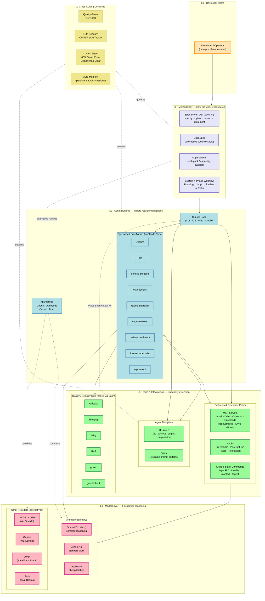
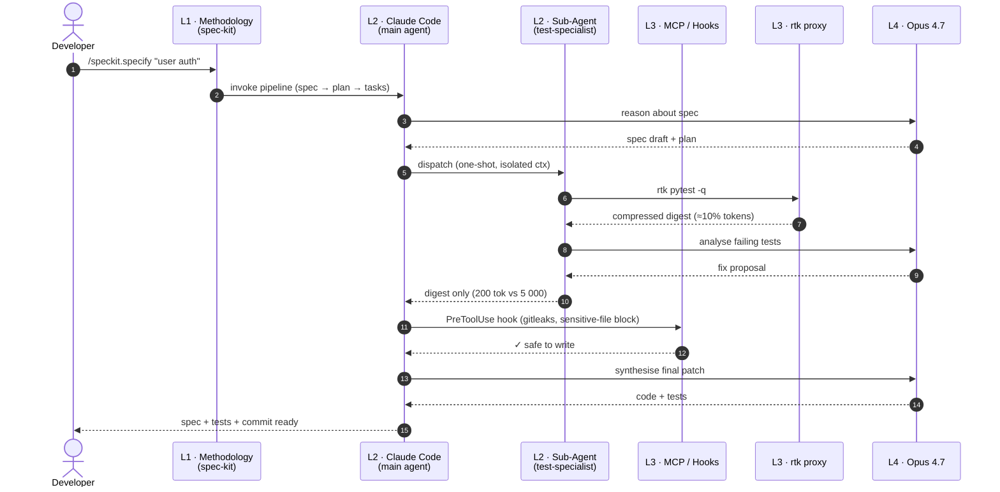

# Framework Technology Stack

> A visual map of the layers, components, and integrations that make the AI Development Framework v4.3 work.
> The framework is *not* a single tool — it is a **composition of methodologies, runtimes, integrations, and models**, with cross-cutting concerns (security, context, quality, memory) governing every layer.

---

## 1. The Layered Stack

The stack reads top-down from **human intent** to **foundation models**. Each layer depends on the one below for raw capability, and serves the one above with structure or reasoning.

### Layer cheat-sheet

| Layer | Question it answers | Examples in this framework |
|------:|---------------------|----------------------------|
| **L0 — Intent** | *What does the human want?* | Developer prompts, plan reviews, approvals |
| **L1 — Methodology** | *How is the work structured?* | spec-kit (SDD), OpenSpec, Superpowers, custom 4-phase workflow |
| **L2 — Agent Runtime** | *Who is doing the reasoning?* | Claude Code (primary) + 9 specialised sub-agents; alternatives: Codex, Opencode, Cursor |
| **L3 — Tools & Integrations** | *How does the agent reach the world?* | MCP servers, hooks, skills, **rtk** (compression), **Fabric** (patterns), security CLIs |
| **L4 — Models** | *What actually generates the tokens?* | Opus 4.7 / Sonnet 4.6 / Haiku 4.5; alternatives: GPT, Gemini, Qwen, Llama |
| **⊥ — Cross-cutting** | *What governs every layer?* | Quality gates, LLM security, context management, persistent memory |

---

## 2. Request Flow — How a Single Prompt Traverses the Stack

Concrete example: developer issues `/speckit.specify "add user auth"`. Notice where **rtk** intercepts and where the **sub-agent** isolates context.

### What the flow reveals

- **L1 governs structure**, not execution. spec-kit doesn't *do* anything — it shapes how the agent thinks.
- **L2 is the only layer that holds conversation state.** Sub-agents are dispatched and their context is *thrown away* — only the digest returns. This is the framework's primary defence against the "Dumb Zone" (>40% context usage).
- **L3 is where token economics happen.** `rtk` compresses noisy CLI output before it ever enters L2's context. MCP hooks enforce safety boundaries the model cannot bypass.
- **L4 is stateless.** Models receive a prompt and emit a response — every other layer exists to give them the right context and route their output safely.

---

## 3. The Combination Effect

The framework's value is not in any single layer — it is in their **composition**:

- A **methodology** (L1) without an **agent** (L2) is a manifesto.
- An **agent** (L2) without **tools** (L3) is a chatbot.
- **Tools** (L3) without **rtk / sub-agents** drown the agent in tokens and push it into the Dumb Zone.
- A **model** (L4) without the cross-cutting **quality / security / memory** layers will hallucinate, leak secrets, or forget yesterday's decisions.

Every layer's job is to make the layer above it *more reliable* than it would be alone — and to make the layer below it *more efficient* than it would be alone.

---

## 4. Currently In Use vs Available

| Component | Status on this machine | Notes |
|-----------|------------------------|-------|
| spec-kit (SDD) | ✅ active | `.claude/commands/speckit.*` |
| OpenSpec | ⚪ not adopted | Alternative to spec-kit |
| Superpowers | ⚪ pattern only | Skill-pack architecture is the influence, not the literal repo |
| Claude Code | ✅ primary runtime | Opus 4.7 1M ctx default |
| Codex / Opencode / Cursor | ⚪ alternatives | Same methodology layer would still apply |
| MCP: Gmail, Drive, Calendar, voicemode | ✅ authenticated | See `~/.claude/mcp.json` |
| MCP: Semgrep, Snyk, SonarQube | ⚪ optional | Add only when CLI scans aren't enough |
| **rtk v0.37** | ✅ available (auto-detected per machine) | 60–90% token reduction on common dev commands |
| Fabric | ⚪ pattern reference | Prompt-pattern library, used selectively |
| gitleaks · semgrep · trivy · ruff · gosec | ✅ via Bash | Quality / security CLIs |
| Opus 4.7 / Sonnet 4.6 / Haiku 4.5 | ✅ via Anthropic | Model selection per task |

---

*Generated 2026-04-17. Diagrams use Mermaid — they render natively on GitHub, GitLab, Obsidian, and most Markdown viewers.*
